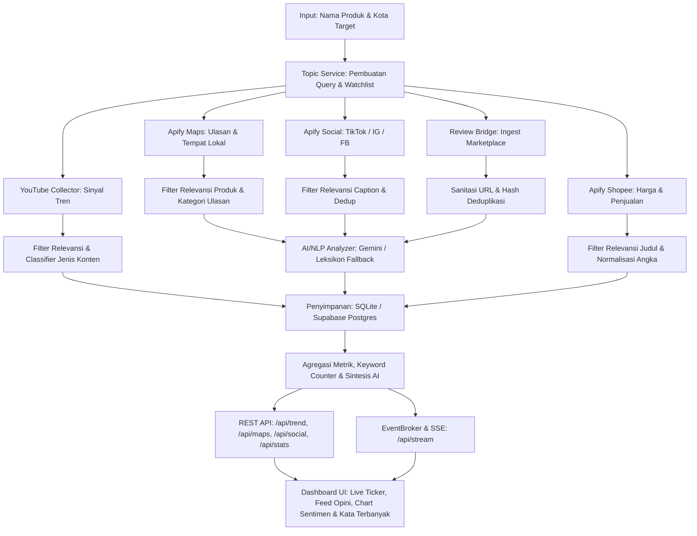

# 01 — Product Overview & Vision

Dokumen ini mendefinisikan visi produk, ruang lingkup, latar belakang studi kasus, serta nilai guna dari sistem **Pemantau Tren & Opini UMKM** yang diimplementasikan pada branch `test` repository `POC_Scrapper`.

---

## 1. Ringkasan Eksekutif & Nama Produk

* **Nama Produk:** Pemantau Tren & Opini UMKM (Takar Market Intelligence / POC v3).
* **Klasifikasi:** Sistem Intelijen Pasar & Pemantauan Opini Publik Multi-Channel untuk Usaha Mikro, Kecil, dan Menengah (UMKM).
* **Status Implementasi:** *Production-ready POC* (P3/M3 + Multi-Source Social & Marketplace Discovery).

Aplikasi ini bukan sekadar web scraper sederhana, melainkan **sistem pemantauan dan analisis sentimen multi-sumber** yang mengumpulkan sinyal pasar dari platform digital terbuka (YouTube, Google Maps, TikTok, Instagram, Facebook, dan Shopee), menyaring data yang relevan terhadap produk spesifik, melakukan analisis sentimen dan aspek secara otomatis, serta menyajikannya dalam dashboard web interaktif berbasis *live feed* dan visualisasi indikator kata kunci/aspek pasar.

---

## 2. Latar Belakang & Landasan Studi Kasus

### Landasan Studi Kasus: PEMANTAU SENTIMEN INOVASI UMKM — STUDY CASE 2
* **Latar Belakang:** UMKM industri kreatif di Indonesia menghadapi tantangan besar dalam membaca tren selera pasar secara cepat dan akurat. Keputusan inovasi produk (varian rasa baru, perbaikan kemasan, penyesuaian harga, atau strategi promosi) sering kali didasarkan pada intuisi tanpa didukung data opini publik yang konkret. Padahal, platform digital terbuka memuat jutaan percakapan, ulasan jujur pelanggan, serta tren video yang sangat kaya akan *actionable insight*.
* **Tugas Pokok:** Membangun dashboard web berbasis **live feed** yang dapat menampilkan opini/sentimen publik terkait produk lokal tertentu secara cepat.
* **Requirement Wajib:**
  1. Menampilkan timeline/feed komentar atau opini publik secara berkala dan terstruktur.
  2. Menampilkan indikator visual sederhana, khususnya penghitung kata kunci/topik yang paling banyak muncul (*keyword frequency counter*).
* **Panduan:** Crawling media sosial dan direktori terbuka sangat disarankan. Menggunakan background script/scheduler untuk mengambil data mentah, mengolah, menyaring, menganalisis sentimen, dan menyajikannya secara efisien ke dashboard.

---

## 3. Problem Statement & Pelajaran dari Iterasi Sebelumnya

Pada implementasi awal (POC v1/v2), pengumpulan data hanya mengandalkan komentar YouTube. Namun, pengujian empiris pada produk UMKM lokal (seperti *cappuccino cincau*, *seblak*, atau *keripik pisang*) membuktikan bahwa:
1. **Komentar YouTube Kurang Merefleksikan Opini Produk:** Mayoritas komentar video YouTube membahas konten video itu sendiri (misalnya ucapan terima kasih kepada kreator, pertanyaan teknis resep, tutorial usaha), bukan evaluasi rasa atau kualitas produk yang dibeli konsumen.
2. **Ketiadaan Ulasan Pelanggan Riil di Video Kreator:** Produk mikro lokal jarang memiliki video ulasan independen di YouTube.
3. **Kebutuhan Pemisahan Sinyal:** UMKM membutuhkan **dua sinyal berbeda**:
   - **Sinyal Tren & Minat Pasar:** Apakah minat publik terhadap produk ini sedang tumbuh atau meredup? Konten apa yang mendominasi (resep, review, atau ide usaha)?
   - **Sinyal Opini & Kepuasan Pelanggan:** Apa yang dipuji dan dikeluhkan konsumen nyata di lapangan terkait rasa, harga, kemasan, dan pelayanan toko/pesaing lokal?

POC v3 menyelesaikan masalah ini dengan membagi peran setiap platform secara tepat dan objektif:
- **YouTube:** Menangkap pasokan konten, laju pertumbuhan penonton (*views growth*), dan sinyal persaingan ide bisnis.
- **Google Maps:** Menangkap ulasan pelanggan nyata di gerai lokal (rasa, harga, pelayanan, kebersihan, porsi).
- **TikTok & Instagram:** Menangkap sentimen konten terkini, respons warganet terhadap tren rasa/kemasan, dan sinyal kreator.
- **Facebook & Shopee:** Menangkap diskusi komunitas lokal dan sinyal harga, rating, serta jumlah produk terjual di marketplace.

---

## 4. Target User & Persona

1. **Pelaku UMKM Kreatif (F&B, Fashion, Kriya):**
   - Ingin mengetahui respon pembeli terhadap produknya dan produk pesaing di kota yang sama.
   - Membutuhkan masukan konkret untuk inovasi produk (misal: "banyak yang mengeluh cincau terlalu keras" atau "konsumen meminta opsi less sugar").
2. **Konsultan / Pendamping Bisnis UMKM:**
   - Membutuhkan data analitik objektif untuk merekomendasikan diversifikasi produk atau strategi penetapan harga berdasarkan harga pasaran dan sentimen kompetitor.
3. **Inovator Produk & R&D Kuliner Lokal:**
   - Memetakan apakah tren suatu produk (seperti kopi susu aren atau seblak prasmanan) masih dalam fase pertumbuhan atau sudah mengalami kejenuhan (*saturation*).

---

## 5. Scope & Out of Scope

### In Scope (Diimplementasikan):
- **Registrasi & Manajemen Topik Pantauan:** Pendaftaran produk dinamis (nama produk, kata kunci pencarian, istilah produk turunan, kata kunci pengecualian/negasi, kategori, dan kota target).
- **YouTube Trend Signal:** Discovery video berbasis kuota, klasifikasi tipe konten (`review`, `resep`, `ide_usaha`, `lainnya`), pencatatan snapshot berkala, dan perhitungan metrik tren (indeks perhatian, pasokan video 30 hari, laju penambahan views).
- **Google Maps Opinion Signal:** Discovery gerai/tempat lokal via Apify Places Crawler, filter relevansi toko dan ulasan berbasis kata produk, pencatatan rating/snapshot ulasan, serta feed opini pelanggan.
- **Social Trend Signal (TikTok, Instagram, Facebook):** Pengambilan post publik relevan via Apify actor, filter batas waktu (*lookback window* 30 hari), dan analisis sentimen teks caption.
- **Marketplace Signal (Shopee):** Pengambilan katalog produk via Apify Shopee scraper, ekstraksi harga, rating, sold count, dan nama toko yang relevan.
- **Marketplace Ingest Bridge (Semi-Live Extension):** Endpoint ingest `/api/ingest/marketplace` untuk menerima data ulasan DOM browser pengguna (Tokopedia, Shopee, TikTok Shop) dengan sanitasi URL dan deduplikasi ID.
- **AI/NLP Pipeline:** Normalisasi slang Indonesia, tokenisasi, ekstraksi kata kunci terbanyak (unigram/bigram), sentiment analyzer berjenjang (Gemini Flash dengan fallback Leksikon lokal beraturan negasi).
- **Sintesis AI:** Rekomendasi inovasi otomatis berbasis ringkasan pujian, keluhan, dan peluang pasar (Gemini / template fallback).
- **Live Feed & SSE:** Dashboard web responsif dengan streaming Server-Sent Events (`/api/stream`) untuk pembaruan metrik dan status instan.

### Out of Scope (Sengaja Dikecualikan & Alasannya):
- **Komentar YouTube Publik (`YT_COMMENTS_ENABLED=false`):** Dinonaktifkan secara sengaja karena bias ke kreator dan boros kuota API.
- **Sistem Otentikasi Pengguna & Multi-tenancy Kompleks:** Sistem dirancang sebagai dashboard operasional lokal/internal tanpa gerbang login yang membebani alur demo.
- **Web Scraping Langsung Tanpa Headless Browser / Bypass CAPTCHA:** Aplikasi tidak menyertakan modul eksploitasi keamanan anti-bot marketplace. Pengambilan data sosial/marketplace menggunakan provider resmi/terkelola (Apify) atau Review Bridge extension milik pengguna.
- **Peta Interaktif JavaScript Berat:** Dashboard berfokus pada intelijen teks dan metrik visual performan (Chart.js & Neo-brutalist Tailwind UI), bukan visualisasi GIS spasial kompleks.

---

## 6. Core Workflow: Input -> Processing -> Output

### Penjelasan Tahapan:
1. **Input:** Pengguna memasukkan nama produk UMKM (misal: "Keripik Pisang") dan memilih kota (misal: "Bandung"). Fitur saran otomatis (`/api/topics/suggest`) menghasilkan kata kunci dan istilah produk pendukung.
2. **Collection:** Background scheduler mengeksekusi pengumpulan data dari sumber yang aktif sesuai jatah kuota dan interval penyegaran.
3. **Relevance Filtering:** Setiap data mentah disaring menggunakan pencocokan kata berbasis morfologi bahasa Indonesia (termasuk klitika `-nya`, `-ku`, `-mu`) serta daftar kata pengecualian noise hiburan (*exclude terms*).
4. **Sentiment & NLP Processing:** Ulasan dan caption yang lolos filter dianalisis polaritas sentimennya (`positif`, `negatif`, `netral`), diekstrak aspeknya (`rasa`, `harga`, `kemasan`, `pelayanan`), dan dihitung frekuensi kata dominannya.
5. **Storage & Serving:** Data tersimpan secara relasional di database (SQLite lokal atau Supabase Postgres di cloud) dan dipancarkan ke antarmuka web melalui REST API dan Server-Sent Events (SSE).

---

## 7. Nilai Relevansi bagi UMKM & Pemenuhan Study Case 2

| Kebutuhan UMKM | Tantangan Tradisional | Solusi yang Disediakan Sistem Ini | Relevansi Study Case 2 |
|---|---|---|---|
| **Mengetahui Tren Minat** | Harus riset pasar manual / bayar agensi mahal | Ticker pertumbuhan views YouTube 24 jam & proporsi konten (resep vs ide bisnis) | Panduan crawling terbuka & scheduler background |
| **Mengetahui Opini Pelanggan** | Hanya mendengar komplain pembeli langsung yang terbatas | Feed ulasan Google Maps & post media sosial dari kompetitor lokal | **Requirement Wajib 1 (Timeline/Feed Opini)** |
| **Mendeteksi Masalah Produk** | Lambat menyadari penurunan kualitas rasa/kemasan | Filter sentimen negatif dan ekstraksi aspek keluhan dominan | Analisis sentimen publik terhadap produk lokal |
| **Mengetahui Kata Kunci Populer** | Sulit merangkum ratusan ulasan teks panjang | Indikator kata kunci paling sering muncul (unigram & bigram) | **Requirement Wajib 2 (Indikator Visual Kata Kunci)** |
| **Ide Inovasi Cepat** | Bingung merancang diferensiasi produk | Sintesis otomatis AI yang merumuskan 3 ide inovasi konkret dari data pasar | Pemantau Sentimen Inovasi UMKM |

---

## 8. Contoh Penggunaan End-to-End

### Skenario: Pelaku Usaha Minuman Lokal Memantau "Es Teh Jumbo"
1. **Pendaftaran Topik:**
   - Pengguna membuka dashboard di browser (`http://127.0.0.1:8000`).
   - Pada form pendaftaran produk, pengguna mengetik: `Es Teh Jumbo` dengan kota `Bandung`.
   - Tombol **Generate Kata Kunci** ditekan. Sistem merekomendasikan keywords: `["es teh jumbo", "es teh"]`, product terms: `["es teh jumbo", "es", "teh", "jumbo"]`, kategori: `makanan_minuman`.
   - Pengguna menekan **Mulai Pantau Sekarang**.
2. **Eksekusi Background:**
   - Scheduler menjalankan pencarian YouTube untuk mendeteksi apakah video es teh jumbo sedang tren (video review pedagang, video modal usaha franchise es teh).
   - Apify Maps mengumpulkan gerai es teh di Bandung dan ulasan pelanggan terkait.
   - Apify Social mengumpulkan video TikTok dan post Instagram dengan tagar/kata es teh jumbo.
3. **Pemrosesan & Sentimen:**
   - Ulasan seperti *"Rasanya segar dan porsinya gede banget, tapi gulanya kemanisan"* lolos filter produk `es teh jumbo`.
   - Analyzer mengklasifikasikan sentimen: `negatif`, skor: `-0.3`, topik: `["rasa"]`.
   - Algoritma NLP menghitung kata kunci dominan: `manis`, `segar`, `porsi`, `antre`, `plastik`.
4. **Hasil pada Dashboard:**
   - Live ticker menampilkan pertambahan views harian video YouTube.
   - Feed opini menampilkan ulasan beserta badge sentimen dan bintang rating.
   - Bar chart sentimen menunjukkan 65% positif, 25% negatif, 10% netral.
   - Komponen Kata Kunci Terbanyak menyorot kata `manis` (keluhan terlalu manis) dan `segar`.
   - Panel Sintesis AI menyimpulkan: *"Konsumen menyukai ukuran porsi jumbo namun mengeluhkan kadar gula yang berlebihan. Ide Inovasi: Sediakan opsi level kemanisan (less sugar) dan varian rasa teh melati otentik."*
