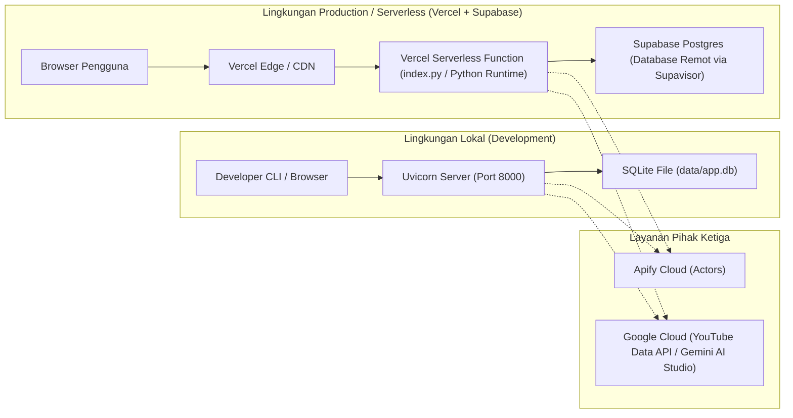

# 02 — System Architecture

Dokumen ini mendokumentasikan arsitektur sistem secara menyeluruh untuk repository `POC_Scrapper` pada branch `test`.

---

## 1. Diagram Arsitektur Tingkat Tinggi

Sistem mengadopsi pola arsitektur **Asynchronous Modular Monolith** dengan pemisahan peran yang tegas antara:
- Ingestion/Collection layer
- Relevance & Processing pipeline
- Data Storage (SQLite / Postgres)
- Async Analyzer Worker
- REST API & Server-Sent Events (SSE) Engine
- Client-Side Reactive Dashboard

```mermaid
flowchart TB
    subgraph ClientLayer ["Client Layer (Browser)"]
        UI["Dashboard Web (index.html / Neo-Brutalist UI)"]
        StateJS["State Manager (state.js)"]
        APIClient["API Client (api.js)"]
        SSEConsumer["EventSource SSE Consumer"]
        Ext["Review Bridge Chrome Extension"]
    end

    subgraph APILayer ["FastAPI Application (app/main.py)"]
        CORS["CORS & Cache-Control Middleware"]
        RouterTrend["/api/trend (*routes_trend.py*)"]
        RouterMaps["/api/maps (*routes_maps.py*)"]
        RouterSocial["/api/social (*routes_social.py*)"]
        RouterMarketplace["/api/marketplace (*routes_marketplace.py*)"]
        RouterTopics["/api/topics (*routes_topics.py*)"]
        RouterStream["/api/stream (*routes_stream.py*)"]
        RouterIngest["/api/ingest (*routes_ingest.py*)"]
        RouterStats["/api/stats (*routes_stats.py*)"]
        RouterSummary["/api/summary (*routes_summary.py*)"]
        RouterHealth["/api/health (*routes_health.py*)"]
        RouterUsage["/api/usage (*routes_usage.py*)"]
    end

    subgraph MessagingLayer ["Messaging & Live Broadcast"]
        Broker["EventBroker (app/events.py)"]
    end

    subgraph BackgroundLayer ["Background Orchestration & Processing"]
        Scheduler["TrendScheduler (app/youtube/trend_scheduler.py)"]
        Worker["AnalyzerWorker (app/analyzer/worker.py)"]
        Limiter["AsyncRateLimiter (app/analyzer/rate_limiter.py)"]
        LegacyRunner["CollectorRunner (app/collectors/runner.py)"]
    end

    subgraph ServiceLayer ["Collectors & Processing Modules"]
        YTDiscovery["YouTube Discovery (app/youtube/trend_discovery.py)"]
        YTSnapshot["StatsSnapshotService (app/youtube/stats_snapshot.py)"]
        MapsCol["MapsCollector (app/maps/collector.py)"]
        SocialCol["SocialCollector (app/social/collector.py)"]
        SocialSent["SocialSentimentService (app/social/sentiment.py)"]
        MarketCol["MarketplaceCollector (app/marketplace/collector.py)"]
        Classifier["ContentTypeClassifier (app/youtube/content_type.py)"]
        GeminiClassifier["GeminiTitleClassifier"]
        TopicSvc["TopicService (app/topics/service.py)"]
        SummarySvc["SummaryService (app/api/routes_summary.py)"]
        NLPEngine["NLP / Keywords Engine (app/nlp/keywords.py)"]
    end

    subgraph ExternalAdapters ["External API Clients & Guards"]
        YTClient["YouTubeClient / PublicYouTubeClient (app/youtube/client.py)"]
        YTQuota["QuotaTracker (app/youtube/quota.py)"]
        ApifyMaps["ApifyMapsClient (app/maps/apify_client.py)"]
        MapsUsage["MapsUsageTracker (app/maps/usage.py)"]
        ApifySocial["SocialApifyClient (app/social/apify_client.py)"]
        SocialUsage["SocialUsageTracker (app/social/usage.py)"]
        ApifyShopee["ShopeeApifyClient (app/marketplace/apify_client.py)"]
        MktUsage["MarketplaceUsageTracker (app/marketplace/usage.py)"]
        GeminiAPI["GeminiAnalyzer (app/analyzer/gemini.py)"]
        LexiconAPI["LexiconAnalyzer (app/analyzer/lexicon.py)"]
    end

    subgraph StorageLayer ["Persistence Layer"]
        DBInterface["Database Abstract Contract"]
        SQLiteDB["SQLite (aiosqlite) - data/app.db"]
        PostgresDB["Supabase Postgres (asyncpg) - schema 'scraper'"]
    end

    %% Client Interactions
    UI --> StateJS
    StateJS --> APIClient
    APIClient --> CORS
    CORS --> APILayer
    SSEConsumer <--> RouterStream
    RouterStream <--> Broker
    Ext --> RouterIngest

    %% API to Internal
    RouterTrend --> DBInterface
    RouterMaps --> DBInterface
    RouterSocial --> DBInterface
    RouterMarketplace --> DBInterface
    RouterTopics --> TopicSvc
    RouterTopics --> Scheduler
    RouterSummary --> SummarySvc
    SummarySvc --> Worker
    RouterStats --> DBInterface
    RouterStats --> NLPEngine

    %% Background Orchestration
    Scheduler --> YTDiscovery
    Scheduler --> YTSnapshot
    Scheduler --> MapsCol
    Scheduler --> SocialCol
    Scheduler --> MarketCol
    Worker --> GeminiAPI
    Worker --> LexiconAPI
    Worker --> Limiter
    Worker --> Broker
    SocialSent --> Worker
    SocialCol --> SocialSent

    %% Collector to Adapters
    YTDiscovery --> YTClient
    YTDiscovery --> Classifier
    Classifier -.-> GeminiClassifier
    YTClient --> YTQuota
    YTSnapshot --> YTClient
    YTSnapshot --> Broker
    MapsCol --> ApifyMaps
    ApifyMaps --> MapsUsage
    SocialCol --> ApifySocial
    ApifySocial --> SocialUsage
    MarketCol --> ApifyShopee
    ApifyShopee --> MktUsage

    %% Persistence
    DBInterface --> SQLiteDB
    DBInterface --> PostgresDB
    YTDiscovery --> DBInterface
    YTSnapshot --> DBInterface
    MapsCol --> DBInterface
    SocialCol --> DBInterface
    MarketCol --> DBInterface
    Worker --> DBInterface
    TopicSvc --> DBInterface
```

---

## 2. Rincian Komponen & Tanggung Jawab

### 2.1 Web Application / Entrypoint
* **Implementasi:** [`app/main.py`](file:///d:/UNDIP/EXASTI/POC_Scrapper/app/main.py), [`index.py`](file:///d:/UNDIP/EXASTI/POC_Scrapper/index.py)
* **Tanggung Jawab:**
  - Instansiasi `FastAPI` aplikasi dengan lifecycle lifespan async (`startup` dan `shutdown`).
  - Pemilihan database backend secara dinamis (`SQLite` vs `Postgres/Supabase`) berdasarkan setting `DATABASE_BACKEND` dan keberadaan `SUPABASE_DB_URL`.
  - Registrasi router API, middleware CORS (termasuk origin Chrome extension), dan header `Cache-Control: no-store` untuk file statis.
  - Inisialisasi background tasks: `CollectorRunner`, `TrendScheduler`, dan `AnalyzerWorker`.
  - Graceful shutdown untuk menutup client HTTP, koneksi database, dan membatalkan task yang sedang berjalan.
* **Input:** Konfigurasi environment via `Settings`.
* **Output:** HTTP Server ASGI (Uvicorn / Vercel Serverless Function).
* **Dependencies:** `fastapi`, `uvicorn`, `pydantic-settings`.

### 2.2 Configuration Management
* **Implementasi:** [`app/config.py`](file:///d:/UNDIP/EXASTI/POC_Scrapper/app/config.py)
* **Tanggung Jawab:**
  - Membaca konfigurasi dari file `.env` dan variabel sistem secara type-safe melalui `pydantic-settings`.
  - Menyediakan nilai default yang aman dan validasi rentang nilai (misal: validasi integer positif, interval waktu > 0).
  - Melakukan normalisasi format daftar sumber (`active_sources`).
  - Menyediakan daftar noise exclusion YouTube default (`youtube_exclude_terms`).
* **Input:** Variabel `.env`.
* **Output:** Objek singleton `Settings`.
* **Dependencies:** `pydantic`, `pydantic-settings`.

### 2.3 Persistence Layer (Database)
* **Implementasi:**
  - [`app/db.py`](file:///d:/UNDIP/EXASTI/POC_Scrapper/app/db.py) (SQLite via `aiosqlite`)
  - [`app/db_postgres.py`](file:///d:/UNDIP/EXASTI/POC_Scrapper/app/db_postgres.py) (Postgres via `asyncpg`)
* **Tanggung Jawab:**
  - Menyimpan data topik, video YouTube, snapshot pertumbuhan metrik, tempat/gerai Maps, ulasan/komentar, post media sosial, produk Shopee, dan log kuota API.
  - Menjaga relasi foreign key, constraint, indeks performa kueri per topik dan waktu.
  - Mengelola data retention / TTL konten Google Maps ulasan (`purge_expired_maps`).
* **Input:** Model Pydantic (`Topic`, `Video`, `CommentIn`, dll.).
* **Output:** Data relasional persisten dan agregasi kueri analitik.
* **Dependencies:** `aiosqlite`, `asyncpg`.

### 2.4 Quota & Rate Limit Trackers (Usage Guards)
* **Implementasi:**
  - [`app/youtube/quota.py`](file:///d:/UNDIP/EXASTI/POC_Scrapper/app/youtube/quota.py) (`QuotaTracker`)
  - [`app/maps/usage.py`](file:///d:/UNDIP/EXASTI/POC_Scrapper/app/maps/usage.py) (`MapsUsageTracker`)
  - [`app/social/usage.py`](file:///d:/UNDIP/EXASTI/POC_Scrapper/app/social/usage.py) (`SocialUsageTracker`)
  - [`app/marketplace/usage.py`](file:///d:/UNDIP/EXASTI/POC_Scrapper/app/marketplace/usage.py) (`MarketplaceUsageTracker`)
* **Tanggung Jawab:**
  - Memastikan panggilan API eksternal yang berbayar atau berkuota ketat tidak melampaui batas harian dan bulanan yang diizinkan.
  - Membedakan kuota pencarian berbiaya tinggi (*search reserve*) dari kuota pembacaan statistik video berbiaya rendah.
  - Mencatat unit pemakaian ke tabel persisten `api_usage`.
  - Mengembalikan `QuotaExhaustedError` atau `UsageCapExceededError` sebelum request dikirim ke pihak ketiga jika kuota sudah habis.
* **Input:** Unit biaya request.
* **Output:** Otorisasi panggilan API atau penolakan terencana.
* **Dependencies:** `app/db.py`.

### 2.5 External API Clients & Scrapers
* **Implementasi:**
  - [`app/youtube/client.py`](file:///d:/UNDIP/EXASTI/POC_Scrapper/app/youtube/client.py) (`YouTubeClient` & `PublicYouTubeClient`)
  - [`app/maps/apify_client.py`](file:///d:/UNDIP/EXASTI/POC_Scrapper/app/maps/apify_client.py) (`ApifyMapsClient`)
  - [`app/social/apify_client.py`](file:///d:/UNDIP/EXASTI/POC_Scrapper/app/social/apify_client.py) (`SocialApifyClient`)
  - [`app/marketplace/apify_client.py`](file:///d:/UNDIP/EXASTI/POC_Scrapper/app/marketplace/apify_client.py) (`ShopeeApifyClient`)
* **Tanggung Jawab:**
  - Berkomunikasi secara asinkron dengan API YouTube (resmi atau public web scraping fallback).
  - Menjalankan Actor Apify (`compass~crawler-google-places`, `clockworks~tiktok-scraper`, `apify~instagram-scraper`, `apify~facebook-search-scraper`, `xtracto~shopee-scraper`).
  - Melakukan polling status eksekusi Actor hingga selesai (`SUCCEEDED`) lalu mengunduh dataset JSON.
  - Memastikan token rahasia (`APIFY_TOKEN`, `YOUTUBE_API_KEY`) hanya digunakan server-side.
* **Input:** Parameter pencarian topik/query dan kota.
* **Output:** Dataset JSON mentah dari platform eksternal.
* **Dependencies:** `httpx`.

### 2.6 Relevance Filtering & Normalization
* **Implementasi:**
  - [`app/maps/relevance.py`](file:///d:/UNDIP/EXASTI/POC_Scrapper/app/maps/relevance.py) & [`app/maps/parsing.py`](file:///d:/UNDIP/EXASTI/POC_Scrapper/app/maps/parsing.py)
  - [`app/youtube/trend_discovery.py`](file:///d:/UNDIP/EXASTI/POC_Scrapper/app/youtube/trend_discovery.py) (fungsi `is_relevant`)
  - [`app/social/parsing.py`](file:///d:/UNDIP/EXASTI/POC_Scrapper/app/social/parsing.py)
  - [`app/marketplace/parsing.py`](file:///d:/UNDIP/EXASTI/POC_Scrapper/app/marketplace/parsing.py)
  - [`app/nlp/preprocess.py`](file:///d:/UNDIP/EXASTI/POC_Scrapper/app/nlp/preprocess.py)
* **Tanggung Jawab:**
  - Menyaring hanya data yang benar-benar menyebutkan nama atau istilah produk UMKM yang dipantau.
  - Menghilangkan noise hiburan (kartun, anime, drama, musik) pada YouTube melalui daftar negasi ketat.
  - Menangani morfologi dan klitika kata dalam bahasa Indonesia (misal: `-nya`, `-ku`, `-mu`) agar "cincaunya" tetap cocok dengan sinyal "cincau".
  - Memisahkan ulasan tempat (`opini_tempat`) dari ulasan yang spesifik mengevaluasi produk (`opini_produk`).
  - Menormalkan angka harga, format rating, dan jumlah penjualan dari format teks Indonesia (contoh: "1,2rb", "2jt", "Rp 15.000").
* **Input:** Payload mentah dari platform.
* **Output:** Entitas terstruktur yang tervalidasi relevan.
* **Dependencies:** Regular expressions, string normalization.

### 2.7 AI & Sentiment Analyzer Worker
* **Implementasi:**
  - [`app/analyzer/worker.py`](file:///d:/UNDIP/EXASTI/POC_Scrapper/app/analyzer/worker.py) (`AnalyzerWorker`)
  - [`app/analyzer/gemini.py`](file:///d:/UNDIP/EXASTI/POC_Scrapper/app/analyzer/gemini.py) (`GeminiAnalyzer`)
  - [`app/analyzer/lexicon.py`](file:///d:/UNDIP/EXASTI/POC_Scrapper/app/analyzer/lexicon.py) (`LexiconAnalyzer`)
  - [`app/analyzer/rate_limiter.py`](file:///d:/UNDIP/EXASTI/POC_Scrapper/app/analyzer/rate_limiter.py) (`AsyncRateLimiter`)
  - [`app/social/sentiment.py`](file:///d:/UNDIP/EXASTI/POC_Scrapper/app/social/sentiment.py) (`SocialSentimentService`)
* **Tanggung Jawab:**
  - Memproses ulasan dan caption berstatus `pending` secara batch non-blocking.
  - Menjaga rate limit panggilan AI (default: 8 RPM) menggunakan leaky-bucket rate limiter.
  - Menganalisis polaritas (`positif`, `negatif`, `netral`), skor kontinu (-1.0 s/d +1.0), dan aspek (rasa, harga, kemasan, dll.).
  - Menyediakan fallback otomatis ke leksikon berbasis aturan ketika kuota Gemini habis (HTTP 429) atau API mengalami kegagalan berulang.
  - Mempublikasikan event `comment_updated` dan `social_sentiment_updated` ke EventBroker.
* **Input:** Teks ulasan atau caption media sosial.
* **Output:** `SentimentResult` (sentimen, skor, aspek topik).
* **Dependencies:** `google-genai` (opsional), file leksikon teks lokal.

### 2.8 Scheduler & Background Orchestration
* **Implementasi:** [`app/youtube/trend_scheduler.py`](file:///d:/UNDIP/EXASTI/POC_Scrapper/app/youtube/trend_scheduler.py) (`TrendScheduler`)
* **Tanggung Jawab:**
  - Memonitor status kedaluwarsa data topik (*stale detection*).
  - Menjalankan discovery YouTube, refresh ulasan Google Maps, refresh post sosial, dan refresh produk Shopee secara berkala sesuai konfigurasi interval.
  - Mengambil snapshot views video secara periodik untuk menghitung laju pertumbuhan views (`views_gain_1h`, `views_gain_24h`).
  - Menguras (*drain*) antrean ulasan dan caption yang belum dianalisis.
* **Input:** Daftar topik aktif dan jadwal cron internal.
* **Output:** Pembaruan data di database dan trigger event SSE.
* **Dependencies:** `asyncio`.

### 2.9 Messaging & Live Feed (EventBroker)
* **Implementasi:** [`app/events.py`](file:///d:/UNDIP/EXASTI/POC_Scrapper/app/events.py) (`EventBroker`)
* **Tanggung Jawab:**
  - Menyediakan in-memory publisher-subscriber berbasis `asyncio.Queue` non-blocking.
  - Mendistribusikan event sistem ke seluruh koneksi browser aktif melalui endpoint Server-Sent Events (SSE).
  - Melindungi producer agar tidak terblokir oleh koneksi browser yang lambat melalui batas antrean (`queue_size=200`) dan `put_nowait`.
* **Input:** Event internal dari collector, scheduler, dan worker.
* **Output:** Stream event HTTP text/event-stream ke browser.
* **Dependencies:** `asyncio`.

### 2.10 REST API Layer
* **Implementasi:** Direktori [`app/api/`](file:///d:/UNDIP/EXASTI/POC_Scrapper/app/api/)
* **Tanggung Jawab:**
  - Menyajikan endpoint data terstruktur untuk dashboard web.
  - Menangani pagination berbasis cursor stabil untuk feed opini.
  - Menyediakan agregasi statistik (distribusi sentimen, sumber, aspek, dan top keywords).
  - Menerima ulasan push dari Chrome Extension melalui `/api/ingest/marketplace`.
* **Input:** HTTP GET / POST / DELETE requests.
* **Output:** JSON response sesuai kontrak Pydantic.
* **Dependencies:** `fastapi`.

### 2.11 Frontend Dashboard
* **Implementasi:** Direktori [`static/`](file:///d:/UNDIP/EXASTI/POC_Scrapper/static/)
* **Tanggung Jawab:**
  - Menampilkan antarmuka responsif bertema *Neo-Brutalist* ("Takar Style").
  - Menghubungkan EventSource ke `/api/stream` untuk memperbarui live ticker dan badge status secara real-time tanpa refresh halaman.
  - Menyajikan navigasi multi-sumber (Overview, Produk Dipantau, Suara Pasar TT/IG, Google Maps, YouTube Tren, Shopee Katalog).
  - Merender visualisasi grafik (Chart.js) untuk perbandingan tren dan distribusi sentimen.
* **Input:** REST API responses & SSE stream.
* **Output:** Antarmuka interaktif yang mudah dipahami pengguna UMKM.
* **Dependencies:** Vanilla JS (ES Modules), Tailwind CSS v3 via CDN, Chart.js.

---

## 3. Deployment Architecture

### Karakteristik Arsitektur Deployment:
1. **Local Development:**
   - Server FastAPI berjalan pada Uvicorn dengan file SQLite lokal (`data/app.db`).
   - Mode scheduler background berjalan penuh pada loop event-loop yang sama.
2. **Serverless Deployment (Vercel):**
   - Menggunakan `index.py` sebagai entrypoint serverless.
   - Vercel memiliki sistem berkas sementara (`/tmp`), sehingga `SUPABASE_DB_URL` dikonfigurasi agar data tersimpan persisten di Supabase Postgres schema `scraper`.
   - `DATABASE_AUTO_MIGRATE=false` diwajibkan untuk mencegah konflik DDL antar-cold starts.
