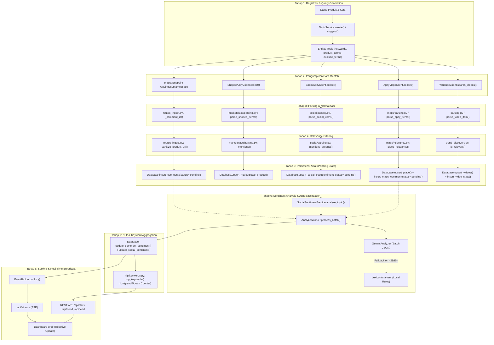

# 04 — Data Pipeline & Transformation Lifecycle

Dokumen ini menjelaskan alur data menyeluruh (*end-to-end data journey*) dari mulai pendaftaran topik oleh pengguna, pembentukan kueri, pengambilan data, normalisasi, filter relevansi, analisis sentimen, ekstraksi aspek dan kata kunci, persistensi database, hingga penyajian ke antarmuka melalui REST API dan Server-Sent Events (SSE).

---

## 1. Diagram Alur Pipeline Data



---

## 2. Rincian Teknis Setiap Tahap Pipeline

### Tahap 1: Registrasi Topik & Query Generation
* **File:** [`app/topics/service.py`](file:///d:/UNDIP/EXASTI/POC_Scrapper/app/topics/service.py), [`app/api/routes_topics.py`](file:///d:/UNDIP/EXASTI/POC_Scrapper/app/api/routes_topics.py)
* **Fungsi / Class:** `TopicService.create(payload)`, `_suggest(name, city)`
* **Input:** `TopicCreate` payload (contoh: `{ name: "Keripik Pisang", cities: ["Bandung"] }`).
* **Transformasi:**
  - Membersihkan whitespace dan duplikasi kata.
  - Membangun `keywords` (istilah pencarian utama) dan `product_terms` (istilah turunan kata produk).
  - Menentukan kategori default (`makanan_minuman` jika memuat kata kunci F&B, selain itu `umum`).
* **Output:** Objek `Topic` yang tersimpan di tabel `topics`.
* **Error Handling:** Validasi Pydantic; membatasi maksimal 20 topik aktif (`MAX_ACTIVE_TOPICS`), menolak jika melampaui dengan HTTP 409 `TopicLimitError`.

---

### Tahap 2: Pengumpulan Data Mentah (Raw Ingestion)
* **File:**
  - YouTube: [`app/youtube/trend_discovery.py`](file:///d:/UNDIP/EXASTI/POC_Scrapper/app/youtube/trend_discovery.py)
  - Google Maps: [`app/maps/apify_client.py`](file:///d:/UNDIP/EXASTI/POC_Scrapper/app/maps/apify_client.py)
  - Social: [`app/social/apify_client.py`](file:///d:/UNDIP/EXASTI/POC_Scrapper/app/social/apify_client.py)
  - Shopee: [`app/marketplace/apify_client.py`](file:///d:/UNDIP/EXASTI/POC_Scrapper/app/marketplace/apify_client.py)
  - Ingest Marketplace: [`app/api/routes_ingest.py`](file:///d:/UNDIP/EXASTI/POC_Scrapper/app/api/routes_ingest.py)
* **Input:** Parameter kueri dan batas budget tracker.
* **Transformasi:** Panggilan HTTP asinkron via `httpx` ke Google API atau Apify Actor endpoint.
* **Output:** JSON mentah dari respons API/Actor dataset.
* **Error Handling:** Pengecekan status kuota sebelum memanggil provider. Tangani timeout HTTP dan status error dengan logger peringatan, tanpa menghentikan worker service lainnya.

---

### Tahap 3: Parsing & Normalisasi
* **File & Fungsi:**
  - Maps: [`app/maps/parsing.py`](file:///d:/UNDIP/EXASTI/POC_Scrapper/app/maps/parsing.py) (`parse_apify_items`)
  - Social: [`app/social/parsing.py`](file:///d:/UNDIP/EXASTI/POC_Scrapper/app/social/parsing.py) (`parse_social_items`)
  - Shopee: [`app/marketplace/parsing.py`](file:///d:/UNDIP/EXASTI/POC_Scrapper/app/marketplace/parsing.py) (`parse_shopee_items`)
  - Teks Normalizer: [`app/nlp/preprocess.py`](file:///d:/UNDIP/EXASTI/POC_Scrapper/app/nlp/preprocess.py) (`normalize`)
* **Input:** List dictionary mentah dari dataset Apify/API eksternal.
* **Transformasi:**
  - Ekstraksi field defensif menggunakan fungsi fallback (`_first(item, 'title', 'name', ...)`).
  - Konversi format harga bahasa Indonesia (misal: "Rp 15.000", "25rb", "1.2jt") menjadi angka float murni (`_number()`).
  - Pembersihan URL dari parameter pelacak (tracking UTM/referral).
  - Normalisasi bahasa gaul dan singkatan (*slang mapping*) pada teks: `gk/gak/nggak -> tidak`, `bgt -> banget`, `udh -> sudah`, dll.
* **Output:** Objek dataclass terstandarisasi (`ParsedPlace`, `ParsedReview`, `SocialPost`, `MarketplaceProduct`).

---

### Tahap 4: Relevance Filtering
* **File & Fungsi:**
  - YouTube: [`app/youtube/trend_discovery.py`](file:///d:/UNDIP/EXASTI/POC_Scrapper/app/youtube/trend_discovery.py) (`is_relevant`)
  - Maps: [`app/maps/relevance.py`](file:///d:/UNDIP/EXASTI/POC_Scrapper/app/maps/relevance.py) (`place_relevance`, `mentions_product`)
  - Social & Shopee: Pengecekan sinyal produk berbasis regex klitika.
* **Logika Penyaringan:**
  1. **Noise Negation Filter:** Jika teks mengandung kata dalam daftar `exclude_terms` (contoh: *upin ipin, kartun, sinetron, lagu anak*), data langsung didiskualifikasi.
  2. **Product Signals Match:** Teks harus memuat frasa produk (`name`, `keywords`, atau `product_terms`).
  3. **Clitics Expansion:** Menggunakan regex `r"(?<!\w){signal}(?:nya|ku|mu)?(?!\w)"` agar kata berafiks seperti *"cincaunya"* tetap terdeteksi relevan terhadap kata kunci *"cincau"*.
  4. **UMKM Intent Verification (YouTube):** Untuk video dengan kata produk umum, wajib memuat kata konteks usaha/resep/pembelian (`UMKM_INTENT_TERMS`).
* **Output:** Flag boolean relevansi dan penentuan kategori (`opini_produk` vs `opini_tempat`).

---

### Tahap 5: Persistensi Database (Status Awal Pending)
* **File:** [`app/db.py`](file:///d:/UNDIP/EXASTI/POC_Scrapper/app/db.py), [`app/db_postgres.py`](file:///d:/UNDIP/EXASTI/POC_Scrapper/app/db_postgres.py)
* **Fungsi:** `insert_maps_comment()`, `upsert_social_post()`, `insert_comments()`
* **Input:** Model data yang telah lolos filter.
* **Tindakan:**
  - Disimpan dengan status awal `pending` (untuk teks yang butuh analisis sentimen).
  - Deduplikasi berbasis composite primary key (`(id, topic_id)` atau `(platform, post_id, topic_id)`).
  - Mempublikasikan event `comment_new` atau `social_post_new` ke `EventBroker`.
* **Output:** Baris baru tersimpan di tabel `comments` atau `social_posts`.

---

### Tahap 6: Analisis Sentimen & Aspek (Worker Batch)
* **File:**
  - [`app/analyzer/worker.py`](file:///d:/UNDIP/EXASTI/POC_Scrapper/app/analyzer/worker.py) (`AnalyzerWorker`)
  - [`app/analyzer/gemini.py`](file:///d:/UNDIP/EXASTI/POC_Scrapper/app/analyzer/gemini.py) (`GeminiAnalyzer`)
  - [`app/analyzer/lexicon.py`](file:///d:/UNDIP/EXASTI/POC_Scrapper/app/analyzer/lexicon.py) (`LexiconAnalyzer`)
  - [`app/social/sentiment.py`](file:///d:/UNDIP/EXASTI/POC_Scrapper/app/social/sentiment.py) (`SocialSentimentService`)
* **Input:** Antrean teks dengan status `pending` (diambil hingga `batch_size=25` baris).
* **Mekanisme Eksekusi:**
  1. Worker mengambil kumpulan ulasan/caption yang pending.
  2. Jika `AI_MODE=gemini` dan API key tersedia:
     - Request melewati `AsyncRateLimiter` (default 8 RPM).
     - Payload dikirim dalam format batch JSON ringkas `[{"i": "c1", "t": "teks..."}]`.
     - Model mengembalikan sentimen (`positif`, `negatif`, `netral`), skor float `-1.0 s/d +1.0`, dan daftar aspek maksimal 3 topik.
  3. Jika Gemini mengalami rate limit (HTTP 429) atau error berulang:
     - Worker mengaktifkan cooldown periodik.
     - Worker otomatis beralih (*fallback*) ke `LexiconAnalyzer`.
     - Leksikon memproses kata berdasarkan kamus `lexicon_pos.txt` dan `lexicon_neg.txt`, menangani kata sangkalan/negasi (*tidak, bukan, kurang*), serta aturan frasa retoris.
* **Output:** List `SentimentResult`.
* **Database Update:** Status diubah menjadi `analyzed`, skor dan topik aspek disimpan, lalu dipancarkan event `comment_updated` atau `social_sentiment_updated`.

---

### Tahap 7: NLP & Ekstraksi Kata Kunci Dominan
* **File:** [`app/nlp/keywords.py`](file:///d:/UNDIP/EXASTI/POC_Scrapper/app/nlp/keywords.py)
* **Fungsi:** `top_keywords(texts, exclude, n=10, ngram=1)`
* **Input:** Kumpulan teks dari ulasan yang telah tersaring dalam rentang waktu tertentu (*window*).
* **Logika Pemrosesan:**
  1. Setiap teks dinormalisasi dan dipecah menjadi token kata (`tokenize`).
  2. Menyingkirkan token yang panjangnya < 3 karakter.
  3. Membuang kata yang ada di dalam `stopwords_id.txt` (kata hubung, kata ganti, kata tugas bahasa Indonesia).
  4. Membuang kata nama produk itu sendiri (agar tidak mendominasi hitungan, misal kata "seblak" pada topik seblak).
  5. Menghitung frekuensi unigram (1 kata) atau bigram (2 kata berturutan).
  6. Mengurutkan hasil secara deterministik: berdasarkan frekuensi terbesar (`-count`), lalu secara alfabetis (`word`).
* **Output:** Daftar pasangan `(kata/frasa, frekuensi)`.

---

### Tahap 8: Real-Time Broadcast & Visualisasi
* **File:** [`app/events.py`](file:///d:/UNDIP/EXASTI/POC_Scrapper/app/events.py), [`app/api/routes_stream.py`](file:///d:/UNDIP/EXASTI/POC_Scrapper/app/api/routes_stream.py), [`static/app.js`](file:///d:/UNDIP/EXASTI/POC_Scrapper/static/app.js)
* **Fungsi:** `EventBroker.publish()`, `/api/stream`, browser `EventSource` listener.
* **Aksi:**
  - Event `trend_tick` memperbarui angka views di ticker live.
  - Event `comment_updated` memperbarui badge sentimen pada feed ulasan.
  - Event `social_sentiment_updated` memicu kalkulasi ulang distribusi grafik sentimen tanpa memuat ulang seluruh halaman.

---

## 3. Contoh Transformasi Data Riil (Sebelum & Sesudah)

### Contoh A: Ulasan Google Maps (Tahap Ingest -> Normalisasi -> Sentiment)

#### 1. Data Mentah dari Apify Actor Dataset (Sebelum):
```json
{
  "searchString": "cappuccino cincau Bandung",
  "title": "Kedai Cincau Segar Pasirkaliki",
  "placeId": "ChIJb8w9zZ_vaScR2w7qj8vLqAA",
  "address": "Jl. Pasirkaliki No. 120, Bandung",
  "totalScore": 4.6,
  "reviewsCount": 180,
  "reviews": [
    {
      "reviewId": "Ci9zb21lX3JhbmRvbV9pZA",
      "text": "Rasa cappuccino cincaunya mantap bgt, manisnya pas dan cincaunya kenyal! Tp sayang tempat parkirnya sempit bgt.",
      "stars": 5,
      "reviewerName": "Budi Santoso",
      "publishedAtDate": "2026-09-15T08:30:00.000Z"
    }
  ]
}
```

#### 2. Setelah Normalisasi & Relevance Filtering:
```json
{
  "id": "Ci9zb21lX3JhbmRvbV9pZA",
  "topic_id": "cappuccino-cincau",
  "place_id": "ChIJb8w9zZ_vaScR2w7qj8vLqAA",
  "source": "gmaps",
  "text": "Rasa cappuccino cincaunya mantap bgt, manisnya pas dan cincaunya kenyal! Tp sayang tempat parkirnya sempit bgt.",
  "mentions_product": true,
  "category": "opini_produk",
  "status": "pending",
  "sentiment": null,
  "score": null,
  "topics": []
}
```

#### 3. Setelah Melalui Analyzer Worker (Sesudah):
```json
{
  "id": "Ci9zb21lX3JhbmRvbV9pZA",
  "topic_id": "cappuccino-cincau",
  "place_id": "ChIJb8w9zZ_vaScR2w7qj8vLqAA",
  "source": "gmaps",
  "text": "Rasa cappuccino cincaunya mantap bgt, manisnya pas dan cincaunya kenyal! Tp sayang tempat parkirnya sempit bgt.",
  "mentions_product": true,
  "category": "opini_produk",
  "status": "analyzed",
  "sentiment": "positif",
  "score": 0.85,
  "topics": ["rasa", "kemasan"],
  "analyzer": "gemini"
}
```

---

### Contoh B: Produk Shopee Indonesia (Tahap Ingest -> Normalisasi Angka)

#### 1. Data Mentah dari Shopee Scraper Actor:
```json
{
  "itemName": "Keripik Pisang Coklat Lumer Khas Lampung 250gr",
  "item_id": "1892837192",
  "price": "Rp 18.500",
  "originalPrice": "Rp 25.000",
  "ratingStar": "4.8",
  "historicalSold": "1,5rb",
  "sellerName": "Snack Nusantara Official",
  "link": "https://shopee.co.id/Keripik-Pisang-Coklat-Lumer-i.123.1892837192?sp_atk=abc-123"
}
```

#### 2. Setelah Masuk Parser Marketplace:
```json
{
  "platform": "shopee",
  "product_id": "1892837192",
  "topic_id": "keripik-pisang",
  "title": "Keripik Pisang Coklat Lumer Khas Lampung 250gr",
  "price": 18500.0,
  "original_price": 25000.0,
  "rating": 4.8,
  "sold_count": 1500,
  "shop_name": "Snack Nusantara Official",
  "url": "https://shopee.co.id/Keripik-Pisang-Coklat-Lumer-i.123.1892837192",
  "mentions_product": true
}
```
*(Perhatikan bahwa parameter pelacak `?sp_atk=...` otomatis dibuang, format teks "Rp 18.500" dikonversi ke angka murni `18500.0`, dan "1,5rb" dikonversi ke integer `1500`).*
