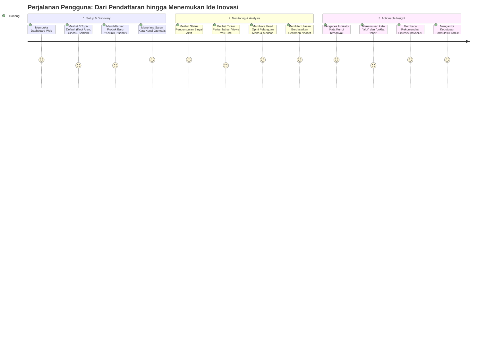

# 05 — Product Requirements Document (PRD)

Dokumen ini mendefinisikan persyaratan produk untuk **Pemantau Tren & Opini UMKM** berbasis studi kasus *Study Case 2: Pemantau Sentimen Inovasi UMKM*.

---

## 1. Product Goal & Objectives

### 1.1 Visi Produk
Menyediakan intelijen pasar berbasis data digital yang cepat, transparan, dan terjangkau bagi pelaku industri kreatif dan UMKM lokal, sehingga keputusan inovasi produk didasarkan pada suara riil pasar, bukan intuisi semata.

### 1.2 Tujuan Utama (Objectives)
1. **Kecepatan Akses Opini (Time-to-Insight):** Mengurangi waktu yang dibutuhkan pelaku UMKM untuk mengetahui ulasan publik tentang produknya dari hitungan hari menjadi hitungan detik melalui dashboard terintegrasi.
2. **Keterbacaan Sentimen Pasar:** Menyajikan proporsi sentimen positif, negatif, dan netral yang dapat difilter berdasarkan sumber platform dan rentang waktu.
3. **Deteksi Aspek Inovasi:** Menyoroti kata kunci terbanyak dan keluhan dominan (rasa, harga, kemasan, porsi) sebagai bahan baku inovasi produk baru.
4. **Validasi Tren Minat:** Mengukur apakah minat publik terhadap suatu kategori produk sedang meningkat, stabil, atau menurun melalui metrik pertumbuhan penonton video YouTube dan katalog marketplace.

---

## 2. User Problem & Context

| Problem yang Dihadapi UMKM | Dampak Negatif | Solusi PRD |
|---|---|---|
| Tidak mengetahui keluhan pembeli secara komprehensif | Produk terus dijual dengan cacat yang sama, pembeli tidak kembali | Feed ulasan multi-channel (Google Maps, TikTok, IG, marketplace) yang teragregasi |
| Sulit menyimpulkan ratusan ulasan teks panjang | Membuang waktu membaca ulasan satu per satu | Indikator visual kata kunci terbanyak (*keyword frequency counter*) & ekstraksi aspek otomatis |
| Bingung menentukan strategi diferensiasi produk baru | Inovasi produk gagal karena tidak sesuai selera pasar lokal | Panel Sintesis AI yang merangkum pujian, komplain, dan ide inovasi produk konkret |
| Takut biaya riset pasar yang mahal | Keputusan bisnis diambil secara spekulatif | Sistem otomatis berbasis platform data terbuka dan crawler terkelola yang hemat biaya |

---

## 3. User Persona

### Persona Utama: Mas Danang (Pemilik Usaha Minuman & Camilan Lokal)
* **Profil:** Pemilik kedai minuman lokal di Bandung dengan 2 cabang.
* **Tujuan:** Ingin meluncurkan varian menu baru bulan depan dan mengevaluasi mengapa menu cappuccino cincau di cabang kedua ratingnya menurun.
* **Pain Points:** Tidak sempat mengecek ulasan Google Maps setiap hari; tidak paham cara scraping data; tidak tahu tren apa yang sedang viral di TikTok anak muda Bandung.
* **Kebutuhan Sistem:** Dashboard web sederhana yang langsung menampilkan:
  1. Apa kata pembeli tentang minumannya hari ini (apakah cincaunya keras? terlalu manis?).
  2. Kata apa yang paling sering disebut pelanggan.
  3. Apakah video ide usaha minuman serupa sedang ramai ditonton di YouTube.

---

## 4. User Journey

---

## 5. Functional Requirements (Persyaratan Fungsional)

### FR-01: Registrasi & Pemantauan Produk (Topic Management)
* Pengguna dapat melihat daftar produk yang sedang dipantau (*watchlist*) beserta status keaktifannya.
* Pengguna dapat mendaftarkan produk baru dengan memasukkan: Nama Produk, Kata Kunci Pencarian, Istilah Produk, Kata Pengecualian (*noise negation*), Kategori, dan Kota Target.
* Pengguna dapat menggunakan fitur saran otomatis (*auto-suggest*) untuk menghasilkan kata kunci dan istilah turunan hanya dari nama produk dan kota.
* Pengguna dapat menonaktifkan atau menghapus produk yang sudah tidak ingin dipantau.
* Sistem membatasi jumlah topik aktif maksimal 20 topik demi menjaga alokasi kuota.

### FR-02: Timeline & Feed Opini Publik (Live Opinion Feed)
* Sistem wajib menampilkan lini masa (*feed*) ulasan dan komentar publik secara kronologis mundur (terbaru di atas).
* Setiap item feed wajib memuat: teks opini, nama platform/sumber, rating bintang (jika ada), label sentimen (`positif`, `negatif`, `netral`, atau `pending`), badge aspek, dan timestamp relatif.
* Sistem mendukung pemuatan data ulasan secara *infinite scroll* atau pagination cursor stabil tanpa lompatan data duplikat.
* Pengguna dapat memfilter feed berdasarkan:
  - Sentimen (`positif`, `negatif`, `netral`).
  - Sumber platform (Google Maps, TikTok, Instagram, Facebook, Shopee, Review Bridge).
  - Rentang waktu jendela (*window*): 1 jam, 24 jam, 7 hari, 30 hari, 90 hari, atau semua waktu.
  - Pencarian kata kunci tertentu di dalam teks ulasan.

### FR-03: Indikator Visual Frekuensi Kata Kunci (Keyword Counter)
* Sistem wajib menyediakan indikator visual yang menampilkan 10 kata yang paling sering muncul dari ulasan pelanggan.
* Sistem mendukung pilihan mode hitung:
  - **Unigram (1 kata):** Menghitung kata tunggal bermakna (misal: "renyah", "manis", "pedas").
  - **Bigram (2 kata):** Menghitung pasangan frasa berurutan (misal: "kurang manis", "bumbu basah", "porsi banyak").
* Algoritma hitung wajib menyingkirkan stopwords umum bahasa Indonesia dan nama produk itu sendiri agar tidak terjadi bias visual.

### FR-04: Analisis Sentimen & Aspek Terotomatisasi
* Sistem secara otomatis menganalisis teks ulasan yang baru masuk menggunakan model bahasa Gemini.
* Jika Gemini tidak tersedia atau mencapai batas kuota, sistem wajib melakukan *fallback* ke penganalisis leksikon lokal berbasis aturan bahasa Indonesia.
* Sistem mengekstrak aspek spesifik yang dibahas (rasa, harga, kemasan, pengiriman, porsi, pelayanan).
* Hasil analisis sentimen menghasilkan skor numerik kontinu dari -1.0 (sangat negatif) sampai +1.0 (sangat positif).

### FR-05: Sinyal Tren Minat & Kompetisi (YouTube Trend Signal)
* Menampilkan jumlah pasokan video 30 hari terakhir dibandingkan 30 hari sebelumnya.
* Menampilkan *Indeks Perhatian* (median views per hari dari video berumur <= 30 hari).
* Menampilkan pertambahan views nyata dalam 1 jam dan 24 jam terakhir.
* Mengklasifikasikan komposisi format konten video: proporsi video *review*, *resep*, *ide usaha*, dan *lainnya*.
* Mendeteksi sinyal peningkatan persaingan jika volume dan proporsi video "ide usaha" bertambah signifikan.

### FR-06: Sinyal Pasar Tambahan (Social & Shopee)
* Menampilkan postingan publik TikTok, Instagram, dan Facebook yang relevan dengan metrik interaksi (likes, comments, views, shares).
* Menampilkan sampel katalog produk Shopee Indonesia untuk kategori sejenis dengan indikator rentang harga (min/max), rating toko, dan jumlah barang terjual (*sold count*).

### FR-07: Sintesis AI & Rekomendasi Inovasi
* Sistem menyajikan ringkasan naratif otomatis dalam 2-3 kalimat berbahasa Indonesia.
* Merangkum maksimal 3 pujian utama pelanggan.
* Merangkum maksimal 3 keluhan pelanggan teratas.
* Merumuskan maksimal 3 ide inovasi konkret yang dapat dieksekusi oleh UMKM.

### FR-08: Pembaruan Data Live (Server-Sent Events)
* Dashboard terhubung secara persisten ke stream SSE `/api/stream`.
* Ticker views dan indikator status penyegaran data diperbarui secara *near real-time* tanpa mengharuskan pengguna memuat ulang (*reload*) browser.

---

## 6. Non-Functional Requirements (Persyaratan Non-Fungsional)

### NFR-01: Performance & Responsiveness
* Dashboard awal harus memuat konten dan status kesehatan API dalam waktu < 2.0 detik pada jaringan standar.
* Respons endpoint REST API untuk pengambilan feed atau tren wajib memiliki latensi rata-rata < 300 ms untuk data terindeks.
* Operasi analisis AI tidak boleh memblokir request HTTP pengguna (dieksekusi secara asynchronous di background worker).

### NFR-02: Availability & Reliability
* Sistem harus dapat berjalan secara terus-menerus (24/7) di lingkungan lokal maupun cloud.
* Jika salah satu sumber eksternal (misal: YouTube API atau Apify) mengalami gangguan jaringan atau kuota habis, modul sumber lain harus tetap berjalan normal (*graceful degradation*).
* Kegagalan pada panggilan Gemini wajib otomatis ditangani oleh Lexicon Analyzer tanpa memunculkan error 500 ke pengguna.

### NFR-03: Scalability & Resource Control
* Sistem wajib memiliki mekanisme pembatasan biaya keras (*hard usage caps*) harian dan bulanan untuk seluruh API pihak ketiga yang berbayar.
* Database dirancang mampu beralih secara transparan dari SQLite lokal ke cloud Supabase Postgres tanpa perubahan kode aplikasi.

### NFR-04: Security & Compliance
* Seluruh API Key dan token eksternal (`APIFY_TOKEN`, `YOUTUBE_API_KEY`, `GEMINI_API_KEY`, `SUPABASE_DB_URL`) wajib berada di sisi server dan tidak boleh bocor ke bundle JavaScript browser.
* Tidak menyimpan informasi identitas pribadi (*PII*) seperti nomor telepon atau username media sosial pelanggan.
* Retensi ulasan Google Maps dibatasi sesuai kebijakan TTL (default 7 hari di database) untuk mematuhi ketentuan platform.

### NFR-05: Maintainability & Code Quality
* Seluruh kode Python wajib memiliki type hints statis lengkap.
* Endpoint API terdokumentasi otomatis melalui OpenAPI / Swagger UI di `/docs`.
* Seluruh alur inti diuji secara terisolasi tanpa memanggil API pihak ketiga sungguhan (memakai fake client / mock transport).

---

## 7. Kriteria Keberhasilan (Success Criteria)

Keberhasilan implementasi dievaluasi langsung terhadap kesesuaian dengan **Study Case 2: Pemantau Sentimen Inovasi UMKM**:

| Kriteria Keberhasilan | Target Parameter | Status Implementasi |
|---|---|---|
| **Kesesuaian Requirement Wajib 1** | Feed ulasan opini publik tampil terstruktur dan dapat difilter secara cepat | **TERPENUHI** (Feed opini Maps, Social, dan Marketplace terintegrasi) |
| **Kesesuaian Requirement Wajib 2** | Indikator visual penghitung kata kunci paling banyak muncul berfungsi deterministik | **TERPENUHI** (Top 10 kata kunci unigram & bigram dengan eliminasi stopwords) |
| **Kesesuaian Panduan Studi Kasus** | Crawling media sosial terbuka & background scheduler pengolah data | **TERPENUHI** (Integrasi YouTube, Maps, TikTok, IG, FB, Shopee via scheduler) |
| **Penyediaan Ide Inovasi** | Dashboard menghasilkan rekomendasi aksi konkret bagi UMKM | **TERPENUHI** (Panel Sintesis AI pujian, keluhan, dan rekomendasi inovasi) |
| **Integritas & Kejujuran Sistem** | Tidak ada data rekaan/palsu; status kuota dan konfigurasi ditampilkan jujur | **TERPENUHI** (Health API & banner jujur jika API key/token belum diisi) |
