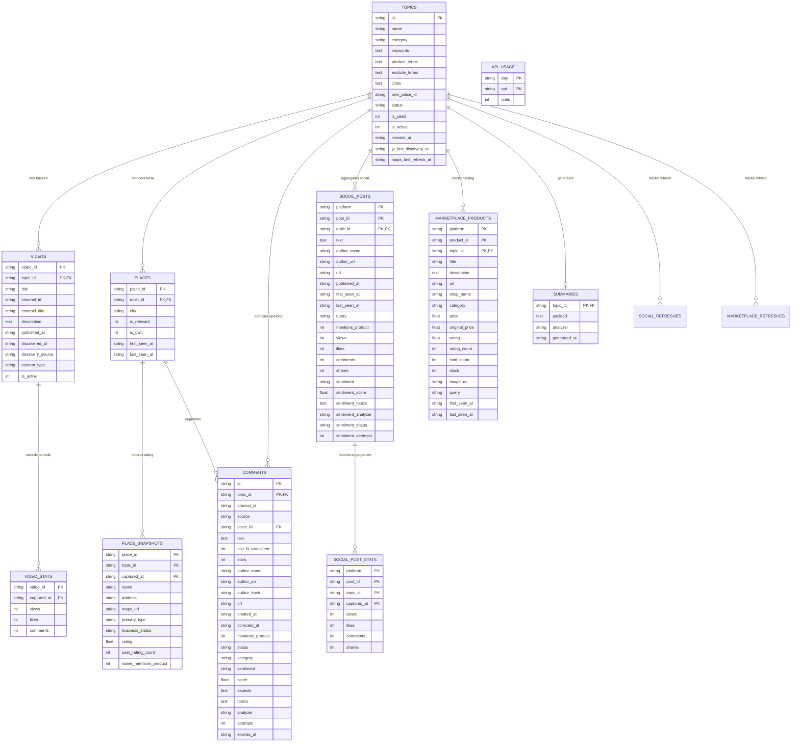

# 09 — Database Architecture & Schema Specification

Dokumen ini mendokumentasikan skema database relasional secara komprehensif, mencakup implementasi SQLite lokal (`aiosqlite`) dan PostgreSQL Supabase (`asyncpg`), Entity Relationship Diagram (ERD), tipe data, indeks performa, siklus hidup data (*data lifecycle*), serta kebijakan retensi data (*data purging*).

---

## 1. Mesin Database & Arsitektur Dual-Backend

Sistem mendukung dua backend database secara transparan:
1. **SQLite (Development / Testing Default):**
   - Menggunakan pustaka asinkron `aiosqlite`.
   - Mengaktifkan mode WAL (*Write-Ahead Logging*) untuk mendukung pembacaan paralel tanpa memblokir penulisan background worker.
   - File default disimpan pada [`data/app.db`](file:///d:/UNDIP/EXASTI/POC_Scrapper/data/app.db).
2. **PostgreSQL / Supabase (Production / Hosted):**
   - Menggunakan driver asinkron `asyncpg`.
   - Seluruh tabel ditempatkan pada skema privat `scraper` (`scraper.topics`, `scraper.videos`, dll.).
   - Hak akses dicabut dari peran publik/anonim (`REVOKE ALL ON SCHEMA scraper FROM PUBLIC, anon, authenticated`) sehingga tabel tidak diekspos melalui Supabase PostgREST Data API. Akses hanya melalui koneksi server-side via `SUPABASE_DB_URL`.

Pemilihan backend dikontrol via konfigurasi:
- Jika `DATABASE_BACKEND=auto`: Memakai Postgres jika `SUPABASE_DB_URL` terisi, jika tidak menggunakan SQLite.
- `DATABASE_AUTO_MIGRATE=false` di lingkungan serverless untuk mencegah eksekusi DDL serentak saat cold start paralel.

---

## 2. Entity Relationship Diagram (Mermaid ERD)



---

## 3. Rincian Skema Tabel & Tipe Data

### 3.1 Tabel `topics` (Watchlist Produk UMKM)
* **Tujuan:** Menyimpan data produk/topik yang dipantau.
* **Kolom:**
  - `id` (`TEXT` / `text`): Primary Key (contoh slug: `cappuccino-cincau`, `seblak`).
  - `name` (`TEXT`): Nama produk UMKM yang dipantau.
  - `category` (`TEXT`): Kategori (`makanan_minuman`, `kecantikan`, `fashion`, `umum`). Default `'umum'`.
  - `keywords` (`TEXT`): JSON array daftar kata kunci pencarian (misal: `["cappuccino cincau", "es cincau"]`).
  - `product_terms` (`TEXT`): JSON array istilah produk turunan untuk verifikasi relevansi.
  - `exclude_terms` (`TEXT`): JSON array kata negasi spesifik topik.
  - `cities` (`TEXT`): JSON array kota target (contoh: `["Bandung"]`).
  - `own_place_id` (`TEXT`): ID tempat Google Maps milik UMKM sendiri (opsional).
  - `status` (`TEXT`): Status pantauan (`discovering`, `active`, `limited`, `inactive`).
  - `is_seed` (`INTEGER`): `1` jika topik bawaan sistem, `0` jika dibuat pengguna.
  - `is_active` (`INTEGER`): `1` jika aktif, `0` jika dinonaktifkan.
  - `created_at` (`TEXT`): Timestamp ISO-8601 UTC pembuatan.
  - `yt_last_discovery_at` (`TEXT`): Timestamp terakhir discovery YouTube dijalankan.
  - `maps_last_refresh_at` (`TEXT`): Timestamp terakhir ulasan Google Maps diperbarui.

---

### 3.2 Tabel `videos` & `video_stats` (YouTube Trends)
* **Tujuan:** Melacak video YouTube relevan dan mencatat snapshot historis pertumbuhan views.
* **Tabel `videos`:**
  - `video_id` (`TEXT`) & `topic_id` (`TEXT`): Composite Primary Key `(video_id, topic_id)`.
  - `title`, `channel_id`, `channel_title`, `description`: Metadata video.
  - `published_at`, `discovered_at`: Timestamp publikasi dan penemuan.
  - `discovery_source`: Metode penemuan (`search_date`, `search_viewcount`, `public_search`).
  - `content_type`: Klasifikasi jenis konten (`review`, `resep`, `ide_usaha`, `lainnya`).
  - `is_active`: Flag status video aktif (`1`/`0`).
  - **Indeks:** `idx_videos_topic ON videos(topic_id, is_active, published_at DESC)`.
* **Tabel `video_stats`:**
  - `video_id` (`TEXT`) & `captured_at` (`TEXT`): Composite Primary Key.
  - `views` (`INTEGER` / `bigint`): Jumlah total penayangan saat snapshot.
  - `likes`, `comments`: Metrik engagement kuantitatif.
  - **Indeks:** `idx_video_stats_time ON video_stats(captured_at)`.

---

### 3.3 Tabel `places` & `place_snapshots` (Google Maps Places)
* **Tujuan:** Menyimpan direktori tempat usaha lokal dan snapshot rating berkala.
* **Tabel `places`:**
  - `place_id` (`TEXT`) & `topic_id` (`TEXT`): Composite Primary Key.
  - `city`: Kota tempat usaha.
  - `is_relevant`: `1` jika toko relevan dengan produk, `0` jika tidak.
  - `is_own`: `1` jika toko milik pengguna sendiri (`place_id == topic.own_place_id`).
  - `first_seen_at`, `last_seen_at`: Timestamp pelacakan pertama dan terakhir.
* **Tabel `place_snapshots`:**
  - `place_id`, `topic_id`, `captured_at`: Composite Primary Key.
  - `name`, `address`, `maps_uri`, `primary_type`, `business_status`: Metadata tempat.
  - `rating` (`REAL` / `double precision`), `user_rating_count`: Skor rating dan jumlah ulasan total.
  - `name_mentions_product`: `1` jika nama tempat secara eksplisit memuat nama produk.

---

### 3.4 Tabel `comments` (Ulasan & Komentar Multi-Sumber)
* **Tujuan:** Menyimpan ulasan pelanggan dari Google Maps, Review Bridge Extension, dan sumber opini lainnya.
* **Kolom Utama:**
  - `id` (`TEXT`) & `topic_id` (`TEXT`): Composite Primary Key `(id, topic_id)`.
  - `product_id` (`TEXT`): ID produk (kompatibilitas v2).
  - `source` (`TEXT`): Platform asal (`gmaps`, `replay`, `youtube`, `playstore`, `inbox`, `tokopedia`, `shopee`, `tiktokshop`).
  - `place_id` (`TEXT`): Foreign key tempat terkait (untuk Google Maps).
  - `text` (`TEXT`): Teks asli ulasan opini pelanggan.
  - `stars` (`INTEGER`): Rating bintang 1 sampai 5.
  - `author_name`, `author_uri`, `author_hash`, `url`: Atribusi penulis dan tautan ulasan.
  - `created_at`, `collected_at`: Waktu ulasan dibuat dan waktu diambil ke sistem.
  - `mentions_product` (`INTEGER`): `1` jika teks menyebutkan produk pantauan.
  - `category` (`TEXT`): Kategori ulasan (`opini_produk`, `opini_tempat`, `lainnya`).
  - `status` (`TEXT`): Status pemrosesan AI (`pending`, `analyzed`, `failed`).
  - `sentiment` (`TEXT`): Label sentimen (`positif`, `negatif`, `netral`).
  - `score` (`REAL`): Skor polaritas kontinu dari `-1.0` hingga `+1.0`.
  - `aspects` / `topics` (`TEXT`): JSON array aspek ulasan (misal: `["rasa", "kemasan"]`).
  - `analyzer` (`TEXT`): Penganalisis yang digunakan (`gemini`, `lexicon`, `mock`).
  - `attempts` (`INTEGER`): Jumlah percobaan analisis yang gagal.
  - `expires_at` (`TEXT`): Batas kedaluwarsa ulasan untuk kepatuhan TTL retensi data.
* **Indeks:**
  - `idx_comments_feed ON comments(topic_id, created_at DESC, id DESC)` — mengoptimalkan pemuatan timeline feed.
  - `idx_comments_pending ON comments(status, collected_at)` — mengoptimalkan query antrean batch analyzer worker.

---

### 3.5 Tabel `social_posts` & `social_post_stats` (Media Sosial)
* **Tujuan:** Menyimpan post publik dari TikTok, Instagram, dan Facebook serta riwayat sentimennya.
* **Tabel `social_posts`:**
  - Composite Primary Key: `(platform, post_id, topic_id)`.
  - `text`: Teks caption unggahan.
  - `author_name`, `author_url`, `url`, `published_at`: Atribusi konten.
  - `mentions_product`: `1` jika caption lolos filter relevansi produk.
  - `views`, `likes`, `comments`, `shares`: Metrik engagement.
  - `sentiment`, `sentiment_score`, `sentiment_topics`, `sentiment_analyzer`: Hasil analisis sentimen.
  - `sentiment_status`: Status analisis (`pending`, `analyzed`, `failed`).
  - **Indeks:** `idx_social_posts_topic ON social_posts(topic_id, published_at DESC)`.
* **Tabel `social_post_stats`:**
  - Composite Primary Key: `(platform, post_id, topic_id, captured_at)`.
  - Mencatat histori pertumbuhan interaksi post sosial dari waktu ke waktu.

---

### 3.6 Tabel `marketplace_products` (Katalog Shopee)
* **Tujuan:** Menyimpan data produk katalog Shopee Indonesia yang relevan.
* **Kolom:**
  - Composite Primary Key: `(platform, product_id, topic_id)`.
  - `title`, `description`, `url`, `image_url`: Informasi katalog.
  - `shop_name`, `category`: Identitas penjual.
  - `price`, `original_price`: Harga jual dan harga coret (diskon).
  - `rating`, `rating_count`, `sold_count`, `stock`: Sinyal performa penjualan pasar.
  - **Indeks:** `idx_marketplace_products_topic ON marketplace_products(topic_id, platform, last_seen_at DESC)`.

---

### 3.7 Tabel `summaries` & `api_usage`
* **Tabel `summaries`:**
  - `topic_id` (`TEXT` Primary Key REFERENCES `topics(id)`).
  - `payload` (`TEXT`): JSON teks hasil sintesis pujian, keluhan, dan rekomendasi inovasi.
  - `analyzer` (`TEXT`): `'gemini'` atau `'template'`.
  - `generated_at` (`TEXT`): Waktu sintesis dibuat.
* **Tabel `api_usage` (Pelacak Biaya & Kuota):**
  - Composite Primary Key: `(day, api)`.
  - `day` (`TEXT`): Format tanggal `YYYY-MM-DD` (zona Pasifik untuk YouTube, UTC untuk Maps/Apify).
  - `api` (`TEXT`): Nama bucket (`yt_search`, `yt_read`, `maps_request`, `social_run`, `marketplace_run`).
  - `units` (`INTEGER`): Jumlah unit panggilan yang telah terpakai pada hari tersebut.

---

## 4. Siklus Hidup Data & Pembersihan Otomatis (Data Retention & Purging)

```
[Pengumpulan] ──> [Parsing & Relevansi] ──> [Penyimpanan Pending]
                                                    │
                                                    ▼
                                          [Analisis Sentimen]
                                                    │
                                                    ▼
[Pembersihan / TTL Purge] <── [Penyajian API/SSE] <── [Penyimpanan Analyzed]
```

### Mekanisme Purging Konten Google Maps:
* **Fungsi:** `purge_expired_maps(now, snapshot_ttl_days)` di [`app/db.py`](file:///d:/UNDIP/EXASTI/POC_Scrapper/app/db.py).
* **Aturan Kepatuhan Privasi:**
  1. Konten teks ulasan dan profil tempat memiliki batas retensi default **7 hari** (`MAPS_CONTENT_TTL_DAYS=7`).
  2. Snapshot tempat yang lebih tua dari `snapshot_ttl_days` dihapus otomatis dari tabel `place_snapshots`.
  3. Ulasan pada tabel `comments` yang memiliki `expires_at <= now` dihapus dari database.
  4. Entitas `place_id` dan relasi tempat pada tabel `places` tetap dipertahankan untuk menjaga riwayat identitas tempat tanpa menyimpan konten ulasan lama.
