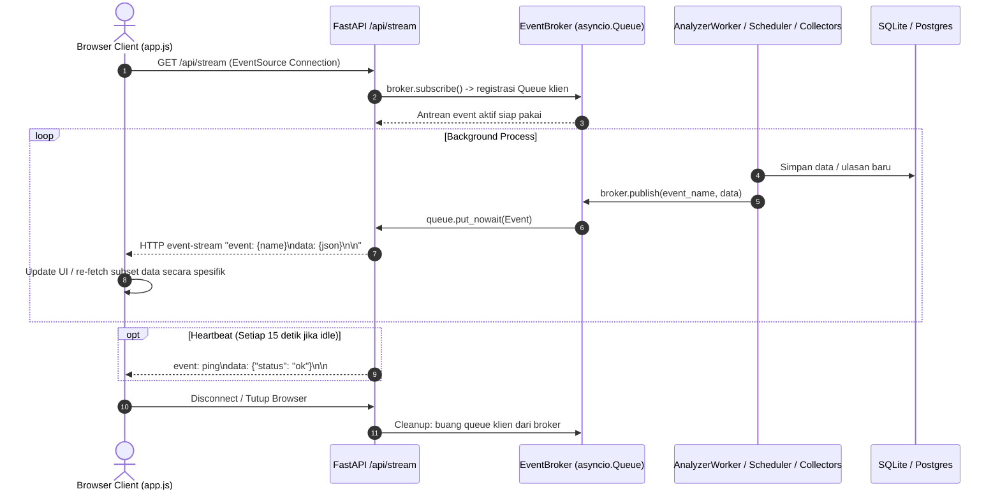

# 11 — Live Feed & Server-Sent Events (SSE) Engine

Dokumen ini mendokumentasikan mekanisme *live feed* dan arsitektur pengiriman event asinkron dari backend ke antarmuka pengguna menggunakan Server-Sent Events (SSE).

---

## 1. Kejujuran Mekanisme Live: Klasifikasi & Hakikat Sistem

Untuk memenuhi prinsip transparansi teknis:
* **Bukan WebSocket Full-Duplex:** Sistem menggunakan **Server-Sent Events (SSE)** satu arah (*server-to-client streaming*) berbasis HTTP standar (`GET /api/stream`), bukan WebSocket dua arah. Ini adalah keputusan desain yang tepat karena dashboard hanya membutuhkan pembaruan status dan metrik secara pasif tanpa perlu mengirim stream biner bolak-balik dari browser.
* **Bukan True Real-Time Push dari Platform Pihak Ketiga:** Platform media sosial (YouTube, Google Maps, TikTok, Instagram) tidak menyediakan webhook publik terbuka untuk aktivitas ulasan warganet secara instan.
* **Hakikat Sistem Sebenarnya:** Sistem ini adalah kombinasi dari:
  1. **Scheduled Background Harvesting:** Pengambilan data berkala oleh background scheduler.
  2. **Asynchronous Stream Broadcasting (Near Real-Time):** Begitu background worker atau scraper menyimpan data baru ke database, sistem memancarkan event seketika (*instant push*) ke seluruh browser klien yang terhubung melalui SSE tanpa menunggu browser melakukan polling HTTP manual.
  3. **Live Ticker Snapshot:** Metrik views YouTube dipantau secara periodik (120 detik di mode demo, 60 menit di mode normal) dan memancarkan event `trend_tick` sehingga ticker di browser tampak terus berdetak secara dinamis.

---

## 2. Arsitektur Event & Diagram Alur



---

## 3. Komponen Backend: `EventBroker`

* **Implementasi:** [`app/events.py`](file:///d:/UNDIP/EXASTI/POC_Scrapper/app/events.py)
* **Karakteristik Desain:**
  1. **Non-blocking In-Memory Pub/Sub:** Menggunakan antrean asinkron `asyncio.Queue(maxsize=200)` per subscriber.
  2. **Fan-Out Bersih:** Satu event yang dipublikasikan oleh background worker didistribusikan ke seluruh antrean browser klien yang aktif.
  3. **Isolasi Lambat (Slow-Consumer Protection):** Pemanggilan `queue.put_nowait()` di dalam blok `try...except asyncio.QueueFull` memastikan bahwa jika ada satu browser dengan koneksi internet yang sangat lambat, producer (worker penarik data) tidak akan mengalami *blocking* atau kehabisan memori.

```python
# Potongan logika inti di app/events.py
async def publish(self, name: str, data: Any) -> None:
    if isinstance(data, BaseModel):
        data = data.model_dump(mode="json")
    for queue in tuple(self._subscribers):
        try:
            queue.put_nowait(Event(name=name, data=data))
        except asyncio.QueueFull:
            continue
```

---

## 4. Endpoint Streaming: `/api/stream`

* **Implementasi:** [`app/api/routes_stream.py`](file:///d:/UNDIP/EXASTI/POC_Scrapper/app/api/routes_stream.py)
* **Header Respons:**
  - `Content-Type: text/event-stream`
  - `Cache-Control: no-cache`
  - `X-Accel-Buffering: no` (mencegah reverse proxy Nginx/Vercel melakukan buffering paket event).
* **Mekanisme Keep-Alive (Heartbeat):**
  Jika tidak ada event baru yang masuk ke antrean dalam 15 detik, endpoint memancarkan event `ping`:
  ```text
  event: ping
  data: {"status":"ok"}
  ```
  Ini mencegah gateway NAT, firewall, atau proxy menutup koneksi TCP secara sepihak (*idle timeout*).

---

## 5. Katalog Tipe Event (SSE Event Types)

Sistem memancarkan 10 jenis event resmi:

| Nama Event | Produser / Pengirim | Payload Utama | Reaksi Dashboard Frontend |
|---|---|---|---|
| `ping` | `routes_stream.py` | `{"status": "ok"}` | Menjaga koneksi tetap hidup; mengonfirmasi status online |
| `trend_tick` | `StatsSnapshotService` | `topic_id`, `views_gain_since_last`, `attention_index` | Memperbarui teks pada `live-ticker` dan memicu refresh data tren secara halus |
| `topic_status` | `TrendScheduler` / `MapsCollector` | `topic_id`, `status`, `source`, `message`, `counts` | Memperbarui badge status topik dan menampilkan banner progress |
| `comment_new` | `MapsCollector` / `routes_ingest.py` / `CollectorRunner` | Objek `CommentIn` / ulasan baru | Menambahkan kartu ulasan baru ke bagian atas feed |
| `comment_updated`| `AnalyzerWorker` | `id`, `status: analyzed`, `sentiment`, `score`, `topics` | Mengubah badge `PENDING` pada kartu ulasan menjadi sentimen dan aspek |
| `analyzer_status`| `AnalyzerWorker` | `ai_mode`, `active_analyzer`, `gemini_healthy`, `pending_count` | Memperbarui indikator kesehatan AI di sidebar |
| `social_post_new`| `SocialCollector` | `platform`, `topic_id`, `post_id`, `text`, `likes`, `views` | Menambahkan post media sosial baru ke feed suara pasar |
| `social_status` | `SocialCollector` / `TrendScheduler` | `topic_id`, `status`, `message`, `counts` | Memperbarui counter ketersediaan post sosial |
| `social_sentiment_updated` | `SocialSentimentService` | `topic_id`, `analyzed`, `pending`, `analyzer` | Memicu kalkulasi ulang grafik distribusi sentimen |
| `marketplace_status` | `MarketplaceCollector` | `topic_id`, `status`, `message`, `counts` | Memperbarui status ketersediaan katalog Shopee |

---

## 6. Komponen Klien Frontend: `connectStream()`

* **Implementasi:** [`static/app.js`](file:///d:/UNDIP/EXASTI/POC_Scrapper/static/app.js)
* **Penggunaan Standar Browser EventSource:**
  ```javascript
  function connectStream() {
    stream?.close();
    stream = new EventSource("/api/stream");
    
    stream.onopen = () => {
      state.streamConnected = true;
      setConnection(true); // Indikator hijau di sidebar
    };
    
    stream.onerror = () => {
      state.streamConnected = false;
      setConnection(false); // Indikator kuning/merah
    };
    
    stream.addEventListener("trend_tick", (event) => {
      const tick = JSON.parse(event.data);
      if (tick.topic_id !== state.activeTopicId) return;
      const ticker = $("live-ticker");
      if (ticker) {
        ticker.textContent = `+${new Intl.NumberFormat("id-ID").format(tick.views_gain_since_last || 0)} sejak snapshot`;
      }
      refreshTrend({ quiet: true });
    });

    stream.addEventListener("topic_status", async (event) => {
      const update = JSON.parse(event.data);
      await loadTopics(update.topic_id === state.activeTopicId ? update.topic_id : "");
      if (update.topic_id === state.activeTopicId) {
        showBanner(update.status, update.message);
        await refreshTrend({ quiet: true });
      }
    });

    stream.addEventListener("social_sentiment_updated", async (event) => {
      const update = JSON.parse(event.data);
      if (update.topic_id === state.activeTopicId) await refreshTrend({ quiet: true });
    });
  }
  ```

### Karakteristik Rekoneksi Otomatis:
Jika server di-restart atau jaringan terputus sementara, objek `EventSource` bawaan browser secara otomatis melakukan rekoneksi ulang (*automatic retry*) setiap beberapa detik tanpa perlu kode JavaScript tambahan yang rumit.
