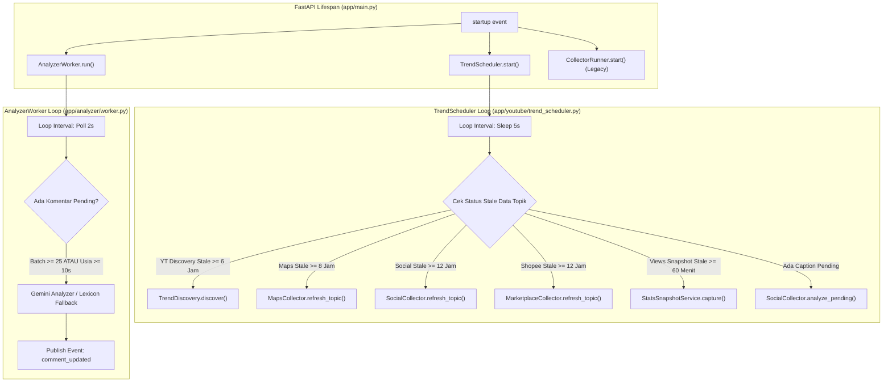

# 12 — Background Scheduler & Worker Orchestration

Dokumen ini mendokumentasikan seluruh proses latar belakang (*background processes*), logika penjadwalan periodik, deteksi data kedaluwarsa (*stale check*), serta batasan kuota pada repository `POC_Scrapper`.

---

## 1. Arsitektur Orkestrasi Latar Belakang

Aplikasi menjalankan tiga worker latar belakang utama secara non-blocking di dalam event-loop FastAPI:

---

## 2. Tabel Master Jadwal Background Tasks

| Job / Task | Interval Default | Sumber Target | File & Fungsi Implementasi | Tujuan & Deskripsi |
|---|---|---|---|---|
| **YouTube Discovery** | `6.0 jam` (`YT_SEARCH_REFRESH_HOURS`) | YouTube Data API / Scraper Publik | [`app/youtube/trend_discovery.py`](file:///d:/UNDIP/EXASTI/POC_Scrapper/app/youtube/trend_discovery.py) -> `TrendDiscovery.discover()` | Mencari video terbaru terkait topik produk, klasifikasi jenis konten (`review`, `resep`, `ide_usaha`), dan menyimpan video baru. |
| **YouTube Stats Snapshot** | `60.0 menit` (`YT_STATS_INTERVAL_MINUTES`); `120 detik` di Demo | YouTube Data API / Scraper Publik | [`app/youtube/stats_snapshot.py`](file:///d:/UNDIP/EXASTI/POC_Scrapper/app/youtube/stats_snapshot.py) -> `StatsSnapshotService.capture()` | Mengambil angka views, likes, dan comments terbaru untuk menghitung pertambahan views 24 jam dan memicu event SSE `trend_tick`. |
| **Google Maps Refresh** | `8.0 jam` (`MAPS_REFRESH_HOURS`) | Apify `compass~crawler-google-places` | [`app/maps/collector.py`](file:///d:/UNDIP/EXASTI/POC_Scrapper/app/maps/collector.py) -> `MapsCollector.refresh_topic()` | Menjalankan Actor Apify per kota, mengumpulkan gerai dan ulasan pelanggan baru, serta menghapus data ulasan yang melampaui TTL 7 hari. |
| **Social Posts Refresh** | `12.0 jam` (`SOCIAL_REFRESH_HOURS`) | Apify (TikTok, Instagram, Facebook) | [`app/social/collector.py`](file:///d:/UNDIP/EXASTI/POC_Scrapper/app/social/collector.py) -> `SocialCollector.refresh_topic()` | Menjalankan scraping tagar/kata kunci sosial, menyaring caption yang relevan, dan mencatat metrik engagement. |
| **Shopee Catalog Refresh** | `12.0 jam` (`MARKETPLACE_REFRESH_HOURS`) | Apify `xtracto~shopee-scraper` | [`app/marketplace/collector.py`](file:///d:/UNDIP/EXASTI/POC_Scrapper/app/marketplace/collector.py) -> `MarketplaceCollector.refresh_topic()` | Mengumpulkan sampel produk Shopee, memperbarui rentang harga, rating toko, dan jumlah penjualan. |
| **Social Sentiment Drain** | Tiap siklus scheduler (jika ada pending) | Internal Database | [`app/social/sentiment.py`](file:///d:/UNDIP/EXASTI/POC_Scrapper/app/social/sentiment.py) -> `SocialSentimentService.analyze_topic()` | Memproses caption media sosial yang masih berstatus `pending` menggunakan analyzer Gemini/Leksikon tanpa memanggil Apify lagi. |
| **Analyzer Worker Batch** | `2.0 detik` polling (`BATCH_MAX_WAIT_SECONDS=10s`) | Database (`comments` table) | [`app/analyzer/worker.py`](file:///d:/UNDIP/EXASTI/POC_Scrapper/app/analyzer/worker.py) -> `AnalyzerWorker.tick()` | Mengambil hingga 25 komentar ulasan yang pending, menganalisis sentimen dan aspek, lalu memperbarui status menjadi `analyzed`. |
| **Legacy Replay Collector** | `4.0 detik` (`REPLAY_INTERVAL_SECONDS`) | File lokal [`data/seed_comments.csv`](file:///d:/UNDIP/EXASTI/POC_Scrapper/data/seed_comments.csv) | [`app/collectors/replay.py`](file:///d:/UNDIP/EXASTI/POC_Scrapper/app/collectors/replay.py) -> `ReplayCollector` | Membaca file ulasan sintetis secara berulang untuk simulasi demo offline tanpa internet. |

---

## 3. Logika Deteksi Data Kedaluwarsa (*Stale Checks*)

Di dalam `TrendScheduler.run()`, setiap topik aktif diperiksa status kesegarannya terhadap waktu saat ini (`now = datetime.now(timezone.utc)`):

### 3.1 YouTube Discovery Stale
Kondisi terpenuhi jika:
$$\text{yt\_last\_discovery\_at} \text{ IS NULL} \quad \lor \quad \text{yt\_last\_discovery\_at} \le \text{now} - \text{YT\_SEARCH\_REFRESH\_HOURS}$$
Jika stale, fungsi `discover_topic(topic)` dieksekusi secara terproteksi oleh lock asinkron per topik (`self._locks[topic.id]`).

### 3.2 Google Maps Stale
Kondisi terpenuhi jika `maps` aktif pada `SOURCES` dan:
$$\text{maps\_last\_refresh\_at} \text{ IS NULL} \quad \lor \quad \text{maps\_last\_refresh\_at} \le \text{now} - \text{MAPS\_REFRESH\_HOURS}$$

### 3.3 Social & Marketplace Stale
Diperiksa per platform melalui tabel pencatat waktu refresh (`social_refreshes` dan `marketplace_refreshes`):
$$\text{last\_refresh} \text{ IS NULL} \quad \lor \quad \text{last\_refresh} \le \text{now} - \text{REFRESH\_HOURS}$$

### 3.4 YouTube Stats Snapshot Stale
Diperiksa per topik melalui snapshot terakhir di tabel `video_stats`:
$$\text{last\_snapshot} \text{ IS NULL} \quad \lor \quad \text{last\_snapshot} \le \text{now} - \text{INTERVAL\_SECONDS}$$
Interval ini adalah 120 detik di mode demo (`DEMO_MODE=true`) atau 60 menit di mode normal.

---

## 4. Mekanisme Kunci & Perlindungan Persaingan (*Concurrency Guard*)

1. **Per-Topic Concurrency Lock:**
   Setiap topik memiliki `asyncio.Lock` independen di `TrendScheduler._locks`. Jika proses discovery untuk topik "cappuccino cincau" sedang berjalan, request pendaftaran ulang atau siklus scheduler berikutnya tidak akan menjalankan proses duplikat yang memboroskan kuota.
2. **Graceful Batch Draining:**
   Jika batas waktu tunggu batch terpenuhi (`age >= batch_max_wait_seconds=10.0`), `AnalyzerWorker` akan mengeksekusi analisis meskipun jumlah ulasan yang terkumpul belum mencapai `batch_size=25`. Ini memastikan ulasan segera muncul di feed dan tidak menggantung (*starvation prevention*).
3. **Usage Tracker Interceptors:**
   Sebelum memanggil API eksternal apa pun, scheduler memverifikasi budget tracker:
   - Jika kuota YouTube habis: Melemparkan `QuotaExhaustedError`, mencatat log peringatan, dan beralih ke snapshot hemat biaya.
   - Jika kuota Apify habis: Melemparkan `UsageCapExceededError`, mempublikasikan status `limited`, dan menunda eksekusi hingga periode reset berikutnya.
