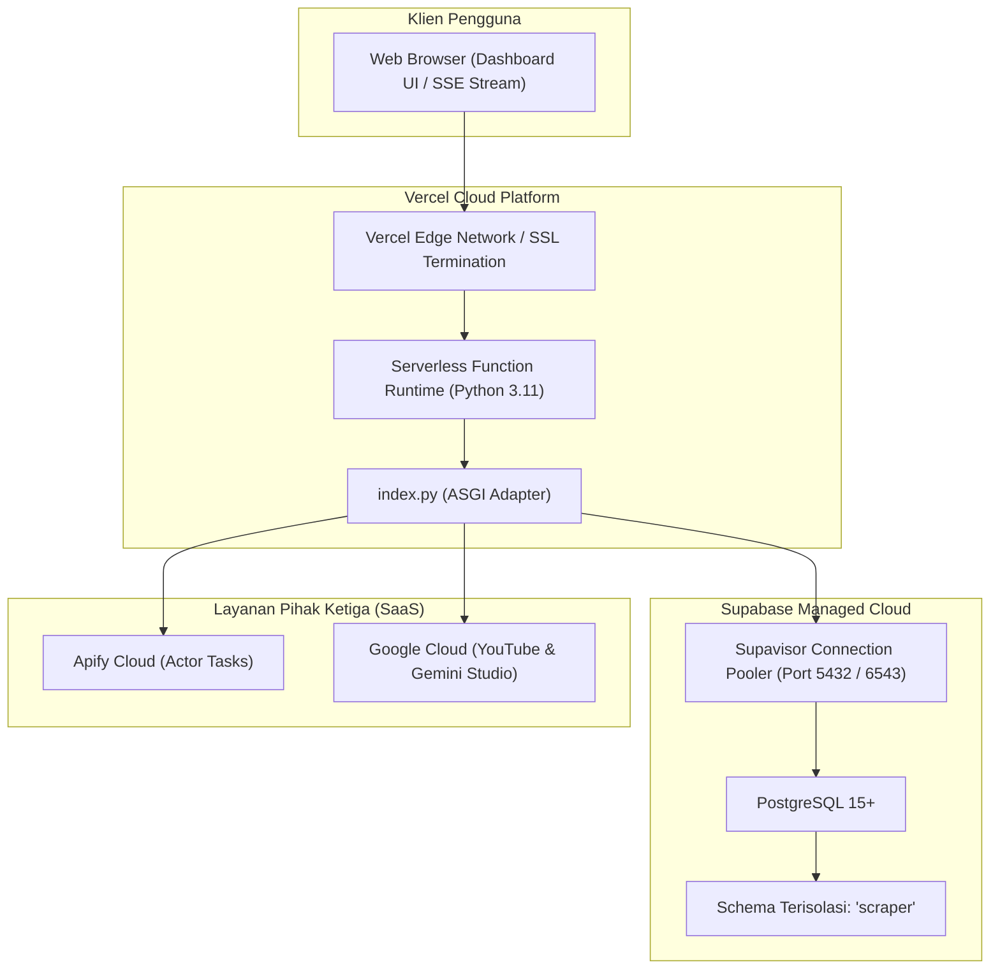

# 16 — Production Deployment & Cloud Infrastructure

Dokumen ini mendokumentasikan panduan deployment produksi aplikasi `POC_Scrapper` ke platform cloud serverless (Vercel) dan database terkelola (Supabase PostgreSQL).

---

## 1. Topologi Arsitektur Deployment



---

## 2. Konfigurasi Serverless: Vercel (`vercel.json` & `index.py`)

### 2.1 File Konfigurasi `vercel.json`
Vercel mengenali file [`index.py`](file:///d:/UNDIP/EXASTI/POC_Scrapper/index.py) di root repository sebagai entrypoint FastAPI serverless:

```json
{
  "$schema": "https://openapi.vercel.sh/vercel.json",
  "functions": {
    "index.py": {
      "maxDuration": 300,
      "excludeFiles": "{tests/**,__tests__/**,scripts/**,design/**,integrations/**,*.md,.env*}"
    }
  }
}
```

* **`maxDuration: 300`:** Mengizinkan fungsi serverless berjalan hingga 300 detik (5 menit). Durasi ini penting untuk mengakomodasi polling status run Actor Apify yang membutuhkan waktu 30-90 detik.
* **`excludeFiles`:** Membuang folder pengujian, dokumentasi, dan skrip probe agar ukuran bundle zip serverless tetap kecil dan cepat saat cold start.

### 2.2 Entrypoint `index.py`
Pada lingkungan serverless, sistem berkas bersifat *read-only* kecuali folder `/tmp`. Berkas [`index.py`](file:///d:/UNDIP/EXASTI/POC_Scrapper/index.py) menetapkan fallback default yang aman:

```python
import os

os.environ.setdefault("SOURCES", "youtube_trend,maps,tiktok,instagram,facebook,shopee")
os.environ.setdefault("AI_MODE", "lexicon")
os.environ.setdefault("DATABASE_PATH", "/tmp/umkm-poc.db")

from app.main import app

__all__ = ["app"]
```
Jika variabel lingkungan `SUPABASE_DB_URL` diisi pada dashboard Vercel, aplikasi secara otomatis mengabaikan berkas `/tmp` dan langsung mengarahkan koneksi ke Supabase PostgreSQL.

---

## 3. Konfigurasi Database Produksi: Supabase PostgreSQL

### 3.1 Skema Privat `scraper`
Untuk keamanan data, seluruh tabel scraper tidak dibuat di skema `public`, melainkan di skema terisolasi `scraper`. Hal ini mencegah data internal terakses secara tidak sengaja melalui antarmuka REST API Supabase otomatis (PostgREST):

```sql
CREATE SCHEMA IF NOT EXISTS scraper;
REVOKE ALL ON SCHEMA scraper FROM PUBLIC, anon, authenticated;
```

### 3.2 Migrasi Database & Aturan Cold Start
* Berkas migrasi database tersedia pada folder [`supabase/migrations/`](file:///d:/UNDIP/EXASTI/POC_Scrapper/supabase/migrations/):
  - `20261002015413_create_scraper_schema.sql` (Inisialisasi tabel v3)
  - `20261002015814_optimize_scraper_keys.sql` (Optimasi indeks dan foreign key)
  - `20261002040000_add_marketplace_sources.sql` (Tabel marketplace dan media sosial)
* **PENTING:** Variabel `DATABASE_AUTO_MIGRATE` **wajib bernilai `false`** di Vercel:
  ```dotenv
  DATABASE_AUTO_MIGRATE=false
  ```
  Alasan: Pada serverless, beberapa container fungsi dapat mengalami *cold start* secara bersamaan. Jika setiap container mencoba menjalankan perintah DDL `CREATE TABLE` secara paralel, akan terjadi kegagalan *catalog lock conflict* pada PostgreSQL. Migrasi harus dijalankan sekali melalui Supabase CLI atau SQL Editor.

---

## 4. Sinkronisasi Data Lokal ke Cloud (`backup_sqlite_to_supabase.py`)

Jika Anda telah mengumpulkan data lokal di SQLite dan ingin memindahkannya ke Supabase sebelum go-live:

1. **Uji Coba Sinkronisasi (*Dry Run*):**
   ```bash
   python scripts/backup_sqlite_to_supabase.py --dry-run
   ```
2. **Eksekusi Migrasi Data ke Supabase:**
   ```bash
   SUPABASE_DB_URL="postgresql://postgres:[PASSWORD]@[HOST]:5432/postgres" python scripts/backup_sqlite_to_supabase.py
   ```
*Karakteristik Skrip:* Bersifat *additive* dan transaksional. Baris data yang sudah ada di database remote tidak akan ditimpa atau dihapus (*idempotent migration*).

---

## 5. Langkah demi Langkah Deployment ke Vercel

### Langkah 1: Siapkan Project Vercel via CLI
Pastikan Vercel CLI telah terpasang (`npm install -g vercel`), lalu login dan hubungkan repository:

```bash
vercel login
vercel link
```

### Langkah 2: Konfigurasi Environment Variables di Vercel Dashboard
Buka halaman **Settings > Environment Variables** pada project Vercel Anda, lalu tambahkan variabel berikut untuk target `Production`:

| Key Environment | Nilai Rekomendasi Produksi |
|---|---|
| `DATABASE_BACKEND` | `postgres` |
| `SUPABASE_DB_URL` | `postgresql://postgres:[PASSWORD]@[HOST]:6543/postgres?pgbouncer=true` *(Gunakan Supavisor Connection Pooler)* |
| `DATABASE_AUTO_MIGRATE` | `false` |
| `SOURCES` | `youtube_trend,maps,tiktok,instagram,facebook,shopee` |
| `APIFY_TOKEN` | *Token API Apify server-side Anda* |
| `YOUTUBE_API_KEY` | *API Key Google Cloud YouTube v3 Anda* |
| `GEMINI_API_KEY` | *API Key Google AI Studio Anda* |
| `GEMINI_MODEL` | `gemini-3.8-flash` |
| `AI_MODE` | `gemini` |
| `LOG_LEVEL` | `INFO` |

### Langkah 3: Eksekusi Deploy ke Production

```bash
vercel --prod
```

Setelah proses build selesai, Vercel akan menghasilkan URL produksi aktif (misal: `https://poc-scrapper.vercel.app`).

---

## 6. Keterbatasan Serverless & Penanganannya

| Keterbatasan Serverless Vercel | Dampak Potensial | Solusi yang Diterapkan di Codebase |
|---|---|---|
| **Koneksi Database Cepat Penuh** | Setiap instance serverless membuka pool koneksi baru | Gunakan connection string **Supavisor Transaction Pooler** (port 6543) pada `SUPABASE_DB_URL` |
| **Tidak Ada Daemon Background Persisten** | Worker scheduler internal mati saat instance idle | Eksekusi trigger pengumpulan dapat dipicu melalui request web reguler atau Vercel Cron Jobs terjadwal |
| **Streaming SSE Terbatas Durasi Fungsi** | Koneksi `/api/stream` tertutup setelah `maxDuration` tercapai | Frontend `app.js` memiliki fitur *auto-reconnect* otomatis via event-loop `EventSource` bawaan browser |
| **Filesystem Statis / Ephemeral** | Data SQLite terhapus saat container di-recycle | Mewajibkan penggunaan `SUPABASE_DB_URL` di production agar data tersimpan di PostgreSQL cloud |
