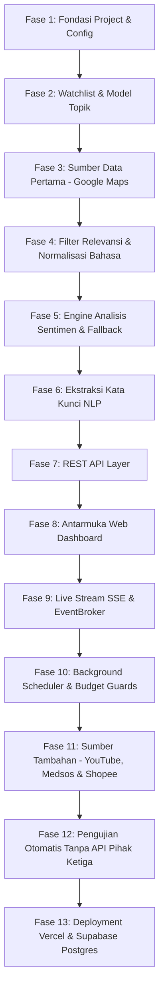

# 19 — Rebuild from Scratch Guide (Zero-to-Hero Roadmap)

Dokumen ini adalah **panduan rekayasa ulang terlengkap** yang memungkinkan seorang programmer baru membangun kembali sistem ini secara persis dari nol (*from scratch*), langkah demi langkah, tanpa memerlukan pengetahuan khusus dari pengembang sebelumnya.

---

## 1. Arsitektur Versi Paling Minimal (Minimum Viable Version / MVP)

Sebelum membangun keseluruhan sistem multi-channel yang kompleks, seorang pengembang harus membangun **Versi Minimal (MVP)** yang telah memenuhi seluruh syarat **Study Case 2: Pemantau Sentimen Inovasi UMKM**:

```
[1. Pendaftaran Topik Produk]
              ↓
[2. Kolektor Google Maps via Apify]
              ↓
[3. Filter Relevansi Produk (Bahasa Indonesia)]
              ↓
[4. Analisis Sentimen (Leksikon / Gemini)]
              ↓
[5. Penghitung Frekuensi Kata Kunci (Unigram/Bigram)]
              ↓
[6. Persistensi Database Relasional (SQLite)]
              ↓
[7. REST API (Topics, Feed, Stats)]
              ↓
[8. Dashboard Web Responsif]
```

### Mengapa Alur MVP di Atas Sudah Cukup Memenuhi Studi Kasus 2?
1. Menjawab masalah pemantauan ulasan produk UMKM lokal secara langsung.
2. Memenuhi **Requirement Wajib 1:** Menampilkan timeline/feed opini publik ulasan pelanggan.
3. Memenuhi **Requirement Wajib 2:** Menampilkan indikator visual penghitung kata kunci terbanyak.
4. Memenuhi panduan crawling platform digital terbuka dengan background processing.

---

## 2. Roadmap Pembangunan Sistem 13 Fase



---

### Fase 1: Fondasi Proyek, Konfigurasi, & Lingkungan
* **Tujuan:** Menyiapkan struktur direktori, virtual environment, konfigurasi type-safe, dan koneksi database SQLite asinkron.
* **Berkas yang Dibuat:**
  - `requirements.txt` (`fastapi`, `uvicorn`, `pydantic-settings`, `aiosqlite`, `httpx`, `pytest`, `pytest-asyncio`).
  - `.env.example` & `.env`
  - `app/config.py` (Class `Settings` menggunakan `pydantic_settings.BaseSettings`).
  - `app/db.py` (Koneksi `aiosqlite` dengan pragmas WAL).
* **Komponen:** Inisialisasi basis data relasional.
* **Dependensi:** Python 3.11+, `pydantic-settings`, `aiosqlite`.
* **Output:** Koneksi database SQLite asinkron berhasil dibuat di `data/app.db`.
* **Checkpoint Validasi:** Jalankan script pengujian koneksi; tabel berhasil di-create tanpa error.

---

### Fase 2: Model & Layanan Pemantauan Produk (Topics)
* **Tujuan:** Mengelola produk UMKM yang dipantau (*watchlist*).
* **Berkas yang Dibuat:**
  - `app/models.py` (Pydantic model `Topic`, `TopicCreate`, `TopicCategory`).
  - `app/topics/service.py` (`TopicService` dengan method `create`, `list`, `seed`).
  - `config/topics.json` (Daftar produk seed: Cappuccino Cincau, Kopi Susu Aren, Seblak).
  - `scripts/reset_db.py` (Skrip reset skema dan seeding awal).
* **Komponen:** Validasi nama produk, pembuatan kata kunci pencarian otomatis, dan penyimpanan topik.
* **Checkpoint Validasi:** Eksekusi `python scripts/reset_db.py`; database terisi 3 topik seed.

---

### Fase 3: Pengumpulan Sumber Data Pertama (Google Maps)
* **Tujuan:** Menghubungkan sistem ke data riil ulasan tempat lokal melalui Apify Actor.
* **Berkas yang Dibuat:**
  - `app/maps/apify_client.py` (`ApifyMapsClient` untuk memicu run `compass~crawler-google-places` dan polling status).
  - `app/maps/errors.py` (`ApifyRunFailedError`, `ApifyPollingTimeoutError`).
  - `app/maps/parsing.py` (`parse_apify_items` mengekstrak tempat dan ulasan).
* **Komponen:** HTTP client asinkron berbasis `httpx`.
* **Checkpoint Validasi:** Buat skrip probe sederhana; sistem berhasil mengambil 5 ulasan mentah dari Google Maps untuk kota Bandung.

---

### Fase 4: Filter Relevansi Produk & Normalisasi Teks Indonesia
* **Tujuan:** Membuang ulasan yang tidak ada hubungannya dengan produk yang dipantau dan membersihkan bahasa gaul/slang.
* **Berkas yang Dibuat:**
  - `app/nlp/preprocess.py` (Fungsi `normalize()` dan kamus `SLANG`).
  - `app/maps/relevance.py` (Fungsi `mentions_product()` dan `place_relevance()`).
* **Logika Inti:**
  - Menggunakan regex klitika bahasa Indonesia: `(?<!\w){signal}(?:nya|ku|mu)?(?!\w)`.
  - Memisahkan ulasan tempat umum dari ulasan yang menyebut rasa/kualitas produk (`category: opini_produk`).
* **Checkpoint Validasi:** Uji teks *"Rasa cincaunya mantap bgt"* terhadap produk *"cincau"* menghasilkan `relevance = True` dan teks ternormalisasi *"rasa cincaunya mantap banget"*.

---

### Fase 5: Mesin Analisis Sentimen & Mekanisme Fallback
* **Tujuan:** Menganalisis polaritas opini pelanggan secara akurat dan tahan terhadap kegagalan kuota AI.
* **Berkas yang Dibuat:**
  - `app/nlp/lexicon_pos.txt` & `app/nlp/lexicon_neg.txt` (Kamus kata sentimen).
  - `app/analyzer/base.py` (`BaseAnalyzer`, `SentimentResult`).
  - `app/analyzer/lexicon.py` (`LexiconAnalyzer` dengan pembalikan kata negasi & aturan kalimat retoris).
  - `app/analyzer/gemini.py` (`GeminiAnalyzer` dengan schema batch JSON).
  - `app/analyzer/rate_limiter.py` (`AsyncRateLimiter` 8 RPM).
  - `app/analyzer/worker.py` (`AnalyzerWorker` pengambil antrean pending).
* **Checkpoint Validasi:** Uji kalimat *"Cincaunya enak tapi tempatnya kotor"* dan *"Siapa sih yang nggak suka es ini?"*; kedua penganalisis memberikan label sentimen yang tepat.

---

### Fase 6: Ekstraksi Kata Kunci Dominan (NLP Engine)
* **Tujuan:** Menghitung kata yang paling sering dibicarakan untuk memenuhi **Requirement Wajib 2**.
* **Berkas yang Dibuat:**
  - `app/nlp/stopwords_id.txt` (Daftar kata tugas/penghubung bahasa Indonesia).
  - `app/nlp/keywords.py` (`top_keywords(texts, exclude, n=10, ngram=1)`).
* **Komponen:** Perhitungan frekuensi unigram dan bigram dengan eliminasi stopwords dan kata nama produk.
* **Checkpoint Validasi:** Uji sekumpulan teks ulasan; kata seperti "dan", "di", atau nama produk tidak muncul pada top 10 kata terbanyak.

---

### Fase 7: Implementasi REST API Layer
* **Tujuan:** Menyediakan antarmuka komunikasi data terstruktur untuk dashboard frontend.
* **Berkas yang Dibuat di `app/api/`:**
  - `routes_health.py` (`GET /api/health`).
  - `routes_topics.py` (`GET /api/topics`, `POST /api/topics`, `POST /api/topics/suggest`, `DELETE /api/topics/{id}`).
  - `routes_maps.py` (`GET /api/maps/places`, `GET /api/maps/feed`).
  - `routes_stats.py` (`GET /api/stats`).
  - `routes_summary.py` (`GET /api/summary`).
* **Checkpoint Validasi:** Jalankan `uvicorn app.main:app` dan buka `/docs`; seluruh endpoint dapat dieksekusi dan mengembalikan format JSON yang valid.

---

### Fase 8: Pembangunan Antarmuka Dashboard Web
* **Tujuan:** Menyajikan visualisasi data yang mudah dipahami pelaku UMKM dengan desain profesional.
* **Berkas yang Dibuat di `static/`:**
  - `index.html` (Struktur Neo-Brutalist, integrasi Tailwind CSS v3 & Chart.js).
  - `styles.css`, `tokens.css` (Variabel warna, bayangan keras 3px, border tebal).
  - `api.js` (Fetch wrapper ke backend).
  - `state.js` (Penyimpan state reaktif di memori browser).
  - `ui.js` (Render fungsi DOM: feed kartu, badge sentimen, bar kata kunci, chart).
  - `app.js` (Controller inisialisasi dan event listener).
* **Checkpoint Validasi:** Buka `http://127.0.0.1:8000` di browser; feed ulasan dan grafik kata kunci tampil proporsional dan responsif.

---

### Fase 9: Live Stream Server-Sent Events (SSE)
* **Tujuan:** Menghadirkan pembaruan data secara real-time tanpa perlu memuat ulang browser.
* **Berkas yang Dibuat:**
  - `app/events.py` (Pub/sub `EventBroker` berbasis `asyncio.Queue` non-blocking).
  - `app/api/routes_stream.py` (Streaming HTTP endpoint `GET /api/stream` dengan heartbeat 15s).
  - Di `static/app.js`: Inisialisasi `new EventSource("/api/stream")`.
* **Checkpoint Validasi:** Simpan ulasan baru via script; kartu ulasan baru seketika muncul di browser yang sedang terbuka.

---

### Fase 10: Background Scheduler & Penjaga Anggaran (Budget Guards)
* **Tujuan:** Mengotomatiskan siklus pengumpulan data berkala dan mencegah pembengkakan biaya API.
* **Berkas yang Dibuat:**
  - `app/maps/usage.py` (`MapsUsageTracker` batas harian/bulanan).
  - `app/youtube/trend_scheduler.py` (`TrendScheduler` pengecek data stale setiap 5 detik).
  - Di `app/main.py`: Pemasangan background tasks pada event lifespan FastAPI.
* **Checkpoint Validasi:** Set interval Maps menjadi 10 detik di test environment; scheduler mengeksekusi refresh otomatis dan mencatat pemakaian unit di tabel `api_usage`.

---

### Fase 11: Menambahkan Sumber Data Sekunder (YouTube, Medsos, Shopee)
* **Tujuan:** Melengkapi data pasar dengan sinyal tren video, konten viral, dan harga pasaran.
* **Berkas yang Dibuat:**
  - Modul YouTube: `app/youtube/` (`client.py`, `trend_discovery.py`, `content_type.py`, `stats_snapshot.py`, `trend_metrics.py`).
  - Modul Sosial: `app/social/` (`apify_client.py`, `collector.py`, `sentiment.py`, `usage.py`).
  - Modul Marketplace: `app/marketplace/` (`apify_client.py`, `collector.py`, `parsing.py`, `usage.py`).
  - Extension Bridge: `integrations/marketplace-extension/` (`manifest.json`, `content.js`).
* **Checkpoint Validasi:** Ticker live YouTube bertambah dan kartu produk Shopee tampil di tab katalog.

---

### Fase 12: Pengujian Menyeluruh (Automated Test Suite)
* **Tujuan:** Memastikan keandalan seluruh sistem tanpa bergantung pada internet atau memakan kuota berbayar.
* **Berkas yang Dibuat di `tests/`:**
  - `conftest.py` (Fixture database `:memory:`).
  - 20 file pengujian mencakup parser, client, API routes, dan worker dengan `httpx.MockTransport`.
* **Checkpoint Validasi:** Jalankan `python -m pytest -q`; 73 test case lulus 100%.

---

### Fase 13: Deployment Produksi Cloud
* **Tujuan:** Mempublikasikan aplikasi ke internet agar dapat diakses kapan saja oleh pelaku UMKM.
* **Berkas yang Dibuat:**
  - `vercel.json` & `index.py` (Konfigurasi serverless Vercel).
  - `app/db_postgres.py` (Koneksi Supabase PostgreSQL di skema privat `scraper`).
  - `scripts/backup_sqlite_to_supabase.py` (Skrip migrasi data lokal).
* **Checkpoint Validasi:** Jalankan `vercel --prod`; aplikasi sukses live di domain Vercel dengan database PostgreSQL Supabase.

---

## 3. Fitur Tambahan Pasca-MVP (Beyond MVP Enhancements)

Setelah MVP stabil, pengembang dapat mengaktifkan fitur-fitur lanjutan yang sudah tersedia di repository ini:
1. **Analisis Format Konten YouTube:** Mengukur apakah tren produk didorong oleh video resep rumahan atau video peluang usaha franchise.
2. **Review Bridge Chrome Extension:** Mengambil ulasan real-time dari toko marketplace tanpa takut terblokir bot anti-scraping.
3. **Multi-Platform Social Aggregation:** Membandingkan sentimen antara pengguna TikTok generasi muda dan diskusi komunitas Facebook.
4. **Perbandingan Toko Sendiri vs Pasar (`own_place_id`):** Membandingkan rating toko milik UMKM sendiri terhadap rata-rata rating kompetitor terdekat.
